# Product Requirements Document: User Flows
## RegattaFlow - Comprehensive User Journey Documentation

**Version**: 1.0
**Last Updated**: 2025-11-10
**Document Owner**: Product Team
**Status**: Active Development

---

## Table of Contents

1. [Executive Summary](#executive-summary)
2. [User Personas](#user-personas)
3. [User Flows - Sailors](#user-flows---sailors)
4. [User Flows - Championship Organizers](#user-flows---championship-organizers)
5. [User Flows - Championship Participants](#user-flows---championship-participants)
6. [Screen Definitions](#screen-definitions)
7. [Edge Cases & Error Handling](#edge-cases--error-handling)
8. [Success Metrics](#success-metrics)

---

## Executive Summary

RegattaFlow serves three distinct user types across two business models:
- **B2C**: Competitive sailors seeking race intelligence and coaching (SaaS subscriptions)
- **B2B**: Championship organizers needing custom-branded event apps (project-based)
- **B2B Users**: Championship participants using organizer-provided apps

This document defines all user journeys, screen flows, and success criteria for each persona, with the **Hong Kong Dragon World Championships 2027** as our flagship use case.

---

## User Personas

### Persona 1: Competitive Sailor (B2C Customer)

**Profile**
- **Name**: Sarah Chen
- **Age**: 32
- **Location**: Hong Kong
- **Boat Class**: Dragon Class
- **Experience**: 8 years competitive sailing
- **Tech Proficiency**: High (daily smartphone user, comfortable with apps)

**Goals**
1. Access detailed venue intelligence for upcoming regattas
2. Improve race performance through AI-powered coaching
3. Learn advanced tactics through online courses
4. Connect with fleet members and track competitor activity
5. Prepare effectively for championship events

**Pain Points**
- Scattered information across email, WhatsApp, PDFs
- No centralized venue knowledge repository
- Limited access to quality coaching (expensive, availability issues)
- Difficulty tracking race preparation and learning progress
- Poor connectivity on water during races

**User Journey Touchpoints**
- Mobile app (primary): iOS/Android
- Web app (secondary): Course viewing, account management
- Email: Subscription confirmations, course completions
- Push notifications: Race updates, coaching insights

**Subscription Tier**: Championship Tier (€250/year)
- Venue intelligence for 147+ global locations
- Personal AI coaching and custom race analysis
- Access to all online courses
- Priority booking for in-person coaching

---

### Persona 2: Championship Organizer (B2B Customer)

**Profile**
- **Name**: Michael Wong
- **Role**: Race Officer, RHKYC
- **Age**: 48
- **Location**: Hong Kong
- **Event**: Dragon World Championships 2027
- **Expected Participants**: 150+ boats
- **Tech Proficiency**: Medium (comfortable with email, basic apps)

**Goals**
1. Create a professional, branded mobile app for 2027 World Championships
2. Streamline competitor registration and logistics coordination
3. Communicate schedule changes instantly to all participants
4. Manage boat shipments and track logistics
5. Publish results efficiently
6. Reduce reliance on email, WhatsApp, and physical notice boards

**Pain Points**
- Manual processes for schedule updates (printing notices, posting to boards)
- No guarantee participants receive critical information
- Poor coordination of international boat shipments
- Fragmented communication channels
- Limited ability to brand championship experience
- Weather-dependent scheduling requires frequent updates

**User Journey Touchpoints**
- Web app (primary): Championship management portal
- Mobile app: On-site management during event
- Email: Participant communications, logistics coordination
- Dashboard: Real-time analytics, participant tracking

**Project Value**: €20,000 for custom championship app
- Branded iOS/Android apps
- Competitor registration system
- Real-time schedule and notice management
- Logistics tracking dashboard
- Results publication system

---

### Persona 3: Championship Participant (B2B End User)

**Profile**
- **Name**: Lars Jensen
- **Age**: 41
- **Location**: Denmark (traveling to Hong Kong)
- **Role**: Competitor at Dragon Worlds 2027
- **Boat**: "Nordic Thunder"
- **Tech Proficiency**: Medium (uses apps for travel, occasionally for sailing)

**Goals**
1. Download championship app and authenticate
2. Receive real-time schedule updates (races frequently postponed due to weather)
3. Access venue maps, weather data, and sailing instructions offline
4. Track boat shipment status from Denmark to Hong Kong
5. View race results immediately after racing
6. Find local information (hotels, restaurants, transportation)

**Pain Points**
- Poor cellular connectivity on water and at yacht club
- Time-sensitive information (race starts) can't be missed
- International travel complicates logistics coordination
- Need offline access to critical documents
- Language barriers in foreign venues

**User Journey Touchpoints**
- Mobile app (exclusive): Custom championship app
- Push notifications: Critical for schedule changes
- Offline mode: Essential for on-water usage
- Email: Pre-event logistics coordination

**App Access**: Free (provided by championship organizer)
- Custom branding: Dragon Worlds 2027 logo, colors
- Schedule access with offline sync
- Real-time push notifications
- Venue intelligence and weather data
- Results viewing

---

## User Flows - Sailors

### Flow 1: Onboarding & Subscription Selection

**User Story**: *As a competitive sailor, I want to sign up and choose the right subscription tier, so that I can access the features I need.*

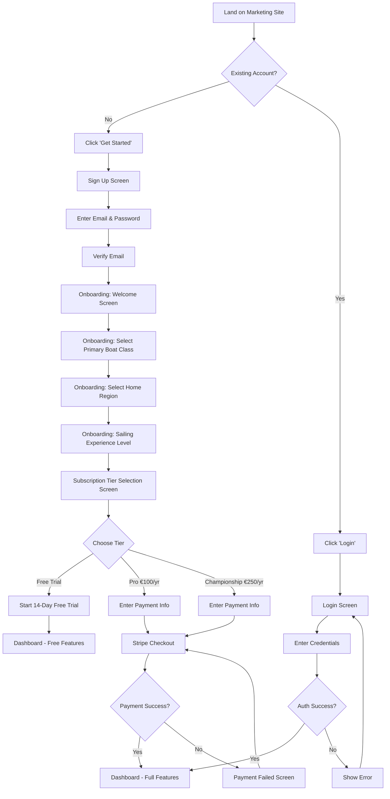

**Screens Involved**: 13 screens
**Average Completion Time**: 5-7 minutes
**Success Criteria**:
- 70%+ of sign-ups complete onboarding
- 25%+ convert to paid subscription within trial period

**Key UX Considerations**:
- Social sign-in options (Google, Apple) for faster onboarding
- Clear tier comparison table highlighting Championship features
- "Start Free Trial" prominent on all tier options
- Progress indicator during onboarding (Step 1 of 4)
- Skip option for non-critical onboarding steps

---

### Flow 2: Browsing & Accessing Venue Intelligence

**User Story**: *As a sailor preparing for an upcoming regatta, I want to browse venue intelligence for the event location, so that I can develop a competitive strategy.*

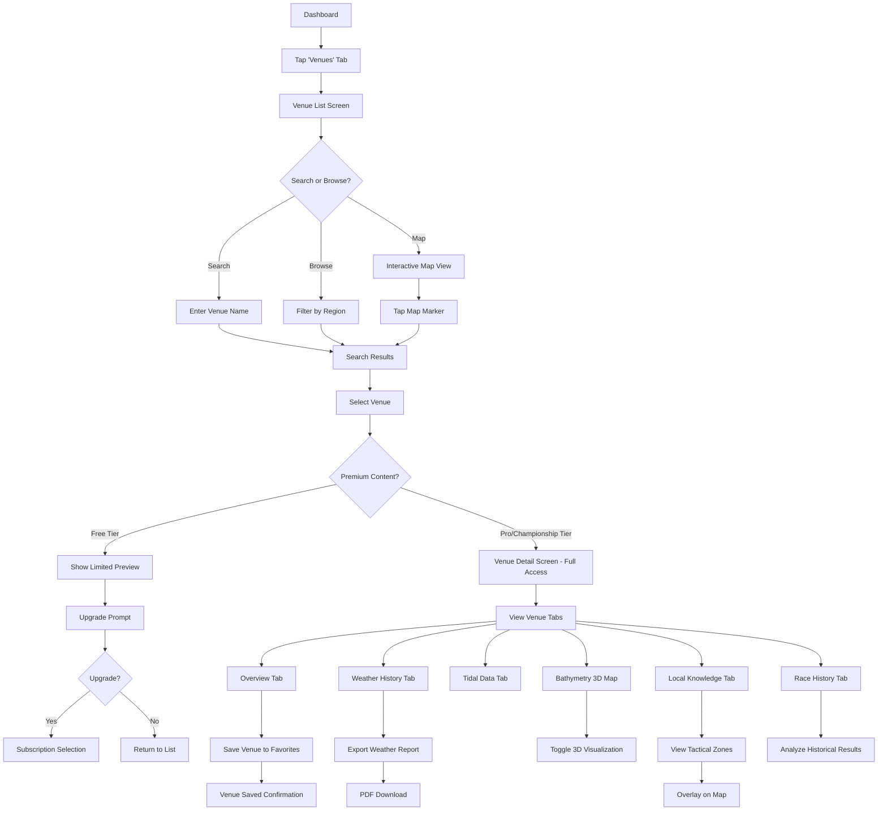

**Screens Involved**: 18+ screens (depending on user path)
**Average Time on Venue Detail**: 8-12 minutes
**Success Criteria**:
- 60%+ of Pro users access venue intelligence weekly
- 10%+ upgrade conversion from free venue previews
- 4.5+ average rating for venue data quality

**Content Gating Strategy**:
- **Free**: Venue name, location, basic overview, 1 sample weather chart
- **Pro**: Full weather history, tidal data, basic bathymetry
- **Championship**: Everything + AI-powered tactical analysis, 3D visualizations

---

### Flow 3: Enrolling in Online Courses

**User Story**: *As a sailor looking to improve my skills, I want to enroll in an online course, so that I can learn advanced tactics at my own pace.*

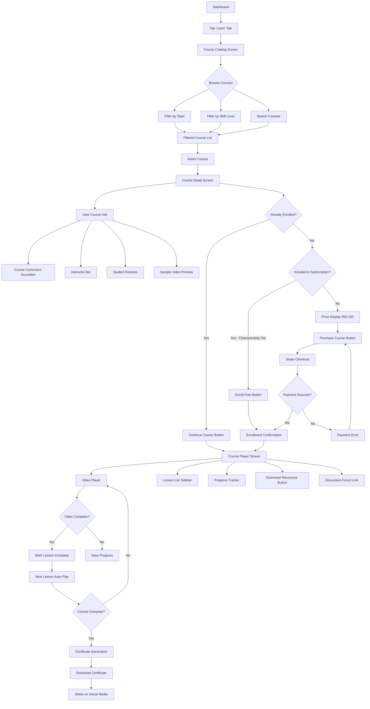

**Screens Involved**: 12 screens
**Average Course Completion Time**: 2-4 hours (spread over days/weeks)
**Success Criteria**:
- 45%+ course completion rate
- 4.3+ average course rating
- 15%+ of course purchases lead to subscription upgrades

**Key Features**:
- Video player with playback speed control (0.75x - 2x)
- Bookmark/note-taking functionality
- Downloadable PDF resources and worksheets
- Mobile-optimized for on-the-go learning
- Offline download for airplane/boat travel

---

### Flow 4: Booking a Coaching Session

**User Story**: *As a sailor seeking personalized improvement, I want to book an in-person coaching session, so that I can get expert feedback on my technique.*

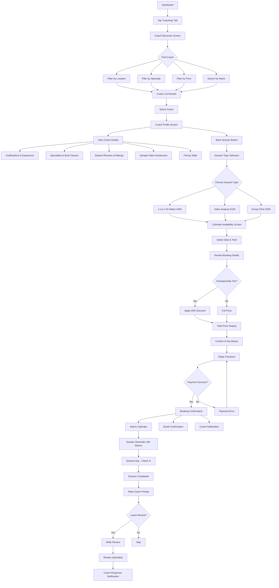

**Screens Involved**: 16 screens
**Average Time to Book**: 6-8 minutes
**Success Criteria**:
- 30%+ of Championship subscribers book coaching within 3 months
- 4.7+ average coach rating
- 15%+ repeat booking rate

**Booking Features**:
- Real-time calendar sync with coach availability
- Automated email/SMS reminders
- Cancellation policy display (48h notice required)
- Video call integration for remote sessions (Zoom link generation)
- Session notes/feedback from coach post-session

---

### Flow 5: Joining a Championship

**User Story**: *As a sailor registered for an upcoming championship, I want to join the event in the app, so that I can receive schedule updates and access venue information.*

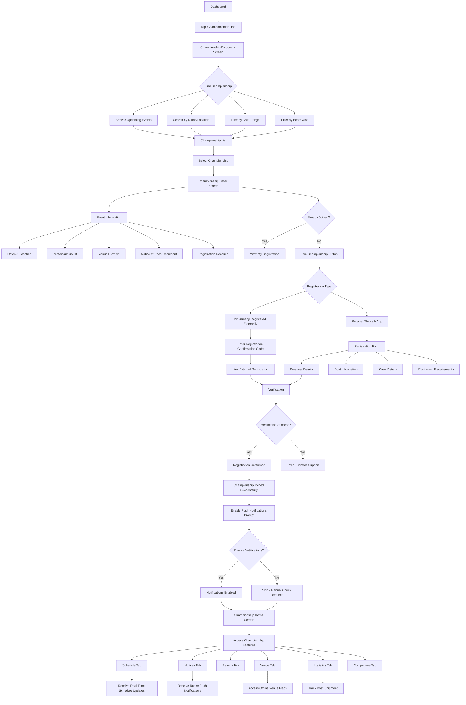

**Screens Involved**: 20+ screens
**Average Time to Join**: 4-6 minutes (if already registered externally)
**Success Criteria**:
- 80%+ of championship participants join app before event
- 95%+ enable push notifications
- <5% support requests related to joining process

**Integration Points**:
- External registration systems (Manage2Sail, SailGate)
- Championship organizer databases
- Payment gateways for entry fees (if applicable)

---

## User Flows - Championship Organizers

### Flow 6: Creating a Championship

**User Story**: *As a championship organizer, I want to create a new championship in RegattaFlow, so that I can provide a professional app experience for my participants.*

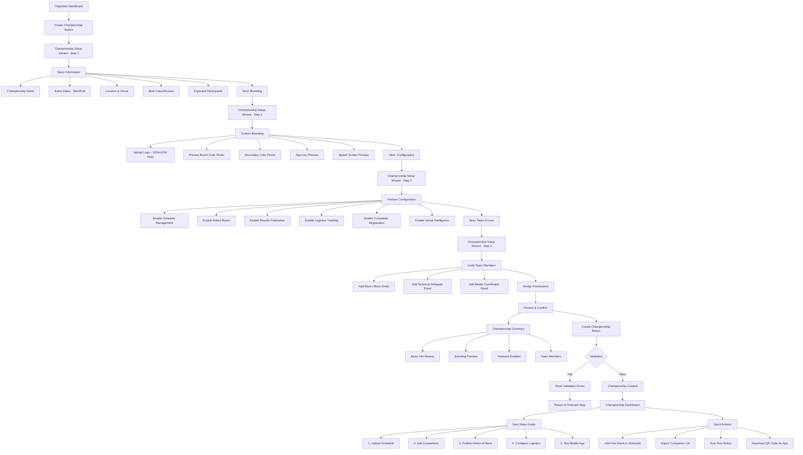

**Screens Involved**: 15 screens (wizard + dashboard)
**Average Time to Create**: 15-20 minutes
**Success Criteria**:
- 90%+ of championships complete setup wizard
- 100% upload custom branding
- Average NPS score of 8+ for setup experience

**Technical Requirements**:
- Logo file validation (format, size, dimensions)
- Color contrast checker for accessibility
- Real-time app preview generation
- Email validation for team invites
- Championship slug generation (unique URL)

---

### Flow 7: Managing Competitor Registration

**User Story**: *As a championship organizer, I want to manage competitor registrations, so that I can track entries and communicate with participants.*

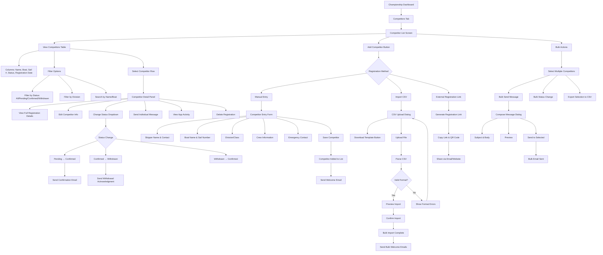

**Screens Involved**: 12 screens
**Average Time on Competitors Tab**: 10-15 minutes per session
**Success Criteria**:
- Support 200+ competitors per championship
- <30 seconds to add single competitor manually
- 95%+ email delivery rate for automated messages

**Bulk Operations**:
- CSV import/export (Excel-compatible format)
- Bulk status updates (e.g., mark all as confirmed)
- Mass communication (filtered by division, status, etc.)

---

### Flow 8: Publishing Schedule & Notices

**User Story**: *As a race officer, I want to publish the daily schedule and post notices, so that all competitors receive updates instantly.*

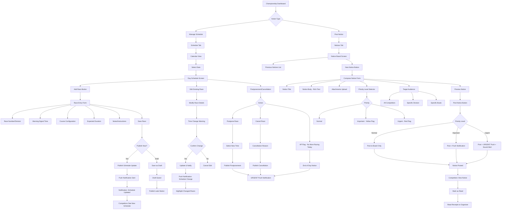

**Screens Involved**: 14 screens
**Critical Path Time**: <60 seconds from decision to publish
**Success Criteria**:
- <5 second push notification delivery (95th percentile)
- 98%+ notification delivery success rate
- 100% competitor reach for urgent notices

**Key Features**:
- **Draft Mode**: Save schedule/notices without publishing
- **Version History**: Track all changes with timestamps
- **Read Receipts**: See who viewed urgent notices
- **Multi-language Support**: Auto-translate for international events
- **Offline Queue**: Notices queue if organizer briefly loses connection

---

### Flow 9: Tracking Logistics

**User Story**: *As a championship organizer, I want to track boat shipments and logistics, so that I can coordinate with international participants.*

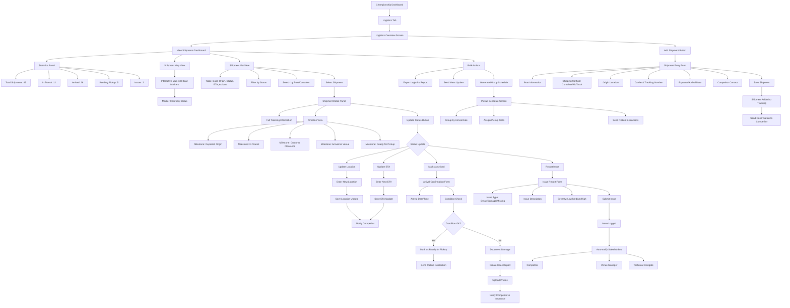

**Screens Involved**: 16 screens
**Average Tracking Updates**: 3-5 per shipment
**Success Criteria**:
- 100% shipment tracking coverage
- 90%+ competitors report "excellent" logistics coordination
- <24 hour response time to reported issues

**Integration Points**:
- Shipping carrier APIs (FedEx, Maersk, DHL)
- Venue management systems
- Competitor contact databases

---

### Flow 10: Entering and Publishing Results

**User Story**: *As a race officer, I want to enter race results and publish them, so that competitors can view standings immediately after racing.*

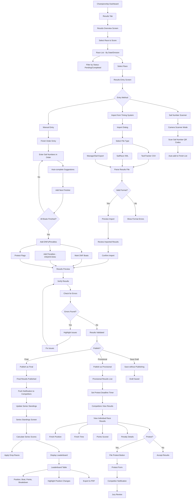

**Screens Involved**: 18 screens
**Critical Timing**: Results published <30 minutes after last finisher
**Success Criteria**:
- 0% calculation errors in series standings
- 95%+ results published same day as race
- <2% protest rate on results accuracy

**Scoring Features**:
- Multiple scoring systems (Low Point, High Point, etc.)
- Customizable series rules (drop races, bonus points)
- Automatic tie-breaking
- Penalty code library (DSQ, OCS, DNF, RAF, etc.)
- Historical results comparison

---

## User Flows - Championship Participants

### Flow 11: Downloading Championship App & Authentication

**User Story**: *As a championship participant, I want to download the championship app and authenticate, so that I can access event information.*

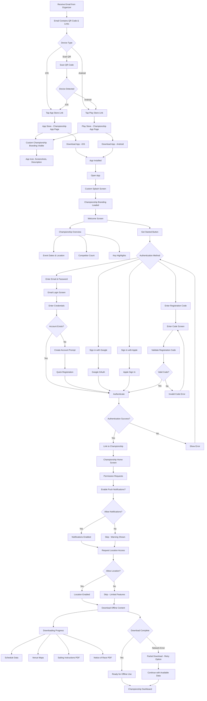

**Screens Involved**: 15 screens (including OS dialogs)
**Average Time to Setup**: 3-5 minutes
**Success Criteria**:
- 95%+ of participants complete setup before event starts
- 98%+ enable push notifications
- 85%+ complete offline content download

**Technical Requirements**:
- Custom app builds per championship (iOS/Android)
- Automated provisioning and code-signing
- Dynamic branding configuration (loaded from server)
- Graceful offline mode activation

---

### Flow 12: Receiving Push Notifications & Schedule Updates

**User Story**: *As a championship participant, I want to receive real-time push notifications for schedule changes, so that I never miss important updates.*

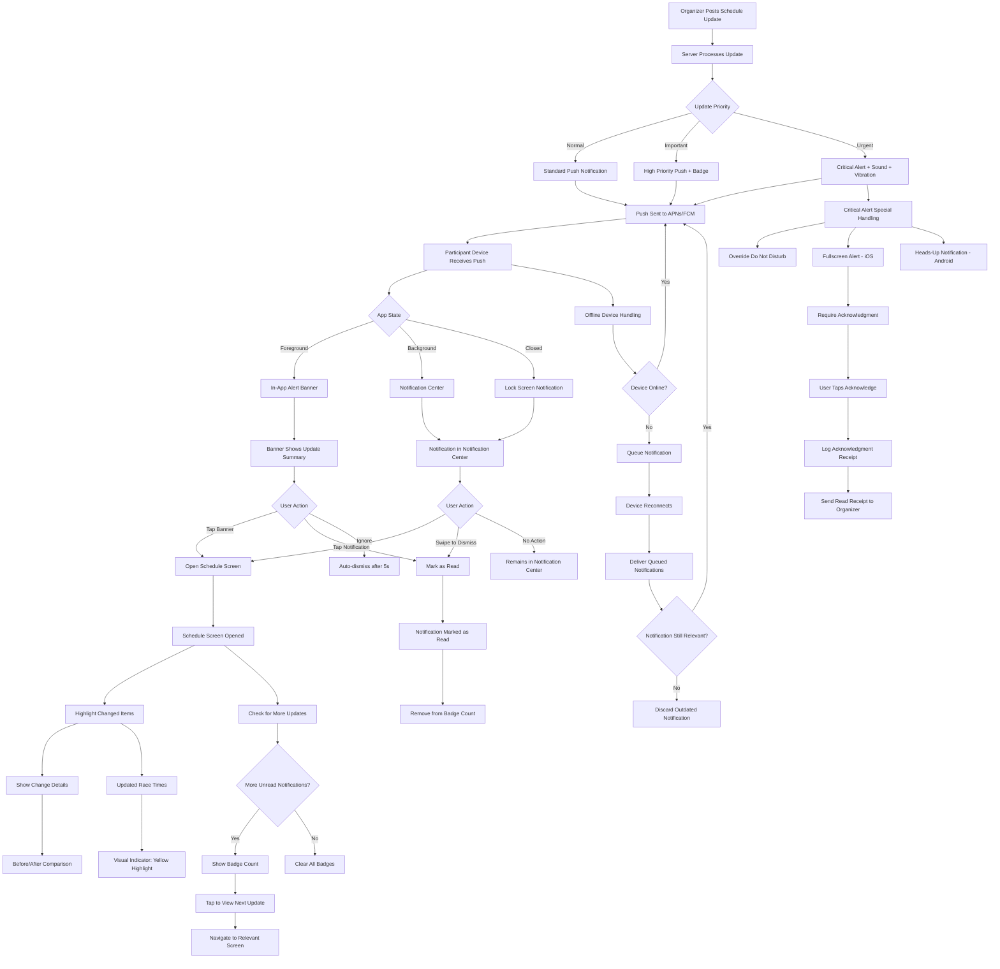

**Technical Flow**: <5 seconds end-to-end
**Delivery Success Rate**: 98%+ (target 99.5%)
**Success Criteria**:
- 100% of urgent notifications delivered within 5 seconds
- 95%+ read rate for urgent notifications within 2 minutes
- <0.1% false positives (incorrect notifications)

**Notification Categories**:
1. **Schedule Changes** - Race time updates, postponements, cancellations
2. **Notices** - Official communications, rule changes
3. **Results** - Provisional and final results published
4. **Logistics** - Boat shipment updates, venue access changes
5. **Safety** - Weather warnings, course changes due to conditions

**Smart Features**:
- **Quiet Hours**: Suppress non-urgent notifications 10pm-7am
- **Duplicate Detection**: Prevent duplicate notifications for same update
- **Batch Notifications**: Group multiple minor updates
- **Language Preference**: Deliver in participant's chosen language

---

### Flow 13: Viewing Schedule Offline

**User Story**: *As a championship participant on the water, I want to view the race schedule offline, so that I can check race times without cellular connectivity.*

```mermaid
flowchart TD
    A[Participant Opens App] --> B{Network Status}

    B -->|Online| C[Load Latest Schedule from Server]
    B -->|Offline| D[Load Cached Schedule from Local Storage]

    C --> E[Sync Check]
    E --> F{Local Cache Outdated?}
    F -->|Yes| G[Download Updated Schedule]
    F -->|No| H[Use Cache, Skip Download]

    G --> I[Save to Local SQLite DB]
    H --> J[Load from SQLite]
    I --> J

    D --> K[Load from SQLite]
    K --> L[Display Offline Mode Indicator]
    L --> M[Yellow Banner: "Offline - Last Updated 2h ago"]

    J --> N[Schedule Screen Displayed]
    K --> N

    N --> O[View Options]
    O --> P[Day View]
    O --> Q[Week View]
    O --> R[My Races Filter]

    P --> S[Today's Schedule]
    S --> T[Race List - Chronological]
    T --> U[Each Race Shows:]
    U --> V[Warning Signal Time]
    U --> W[Race Number & Division]
    U --> X[Course Configuration]
    U --> Y[Estimated Duration]
    U --> Z[Weather Forecast Icon]

    Q --> AA[Week Calendar Grid]
    AA --> AB[Select Date]
    AB --> S

    R --> AC[Filter by User's Division]
    AC --> AD[Show Only Relevant Races]

    T --> AE[Tap Race for Details]
    AE --> AF[Race Detail Screen - Offline Mode]

    AF --> AG[Race Information]
    AG --> AH[Full Schedule Details]
    AG --> AI[Course Map - Cached Image]
    AG --> AJ[Sailing Instructions Excerpt]
    AG --> AK[Competitors List - If Downloaded]

    AF --> AL{Weather Data Available?}
    AL -->|Yes - Cached| AM[Show Cached Forecast]
    AL -->|No| AN[Show "Weather Unavailable Offline"]

    AM --> AO[Forecast from Last Sync]
    AO --> AP[Wind Speed/Direction]
    AO --> AQ[Wave Height]
    AO --> AR[Tidal Information]
    AO --> AS[Timestamp of Forecast]

    AF --> AT[Action Buttons]
    AT --> AU[Add to Calendar - Works Offline]
    AT --> AV[Set Reminder - Works Offline]
    AT --> AW[Share Race - Requires Online]

    AU --> AX[Create Local Calendar Event]
    AX --> AY[Confirmation Toast]

    AV --> AZ[Schedule Local Notification]
    AZ --> BA[Reminder Time Selector]
    BA --> BB[15 min, 30 min, 1 hour, 2 hours]
    BB --> BC[Reminder Set Confirmation]

    AW --> BD{Network Available?}
    BD -->|Yes| BE[Share Sheet]
    BD -->|No| BF[Error: Sharing Requires Internet]

    N --> BG[Pull to Refresh]
    BG --> BH{Network Available?}
    BH -->|Yes| BI[Sync Latest Schedule]
    BH -->|No| BJ[Show "Cannot Refresh Offline"]

    BI --> BK{Updates Found?}
    BK -->|Yes| BL[Download Updates]
    BK -->|No| BM[Show "Already Up to Date"]

    BL --> BN[Highlight Changed Races]
    BN --> BO[Yellow Indicator for Updates]
    BO --> BP[Tap to See Change Details]

    BP --> BQ[Change Log]
    BQ --> BR[Before: 10:00 AM]
    BQ --> BS[After: 11:30 AM]
    BQ --> BT[Reason: Wind Delay]

    L --> BU[Tap Offline Banner]
    BU --> BV{Network Available Now?}
    BV -->|Yes| BW[Force Sync]
    BV -->|No| BX[Show Connectivity Tips]

    BW --> BI
    BX --> BY[Tips Dialog]
    BY --> BZ[Enable WiFi]
    BY --> CA[Move to Different Location]
    BY --> CB[Check Airplane Mode]
```

**Offline Storage Capacity**: 30 days of schedule data
**Cache Update Frequency**: Every 15 minutes when online
**Success Criteria**:
- 100% schedule accessibility offline (if previously synced)
- <1 second load time for cached schedule
- 0% data loss during offline usage

**Technical Implementation**:
- **SQLite Database**: Local storage for schedule, notices, results
- **Image Caching**: Course maps, venue photos
- **PDF Caching**: Sailing instructions, NOR documents
- **Smart Sync**: Only download changed data (delta sync)
- **Compression**: Minimize storage footprint

**Offline Capabilities**:
✅ View schedule
✅ View race details
✅ View cached weather
✅ Add to calendar
✅ Set reminders
✅ View previously synced results
❌ Receive live updates (requires connection)
❌ Post to notice board
❌ Submit protests
❌ Share content

---

## Screen Definitions

### Screen 1: Subscription Tier Selection

**Screen Name**: `SubscriptionTiersScreen`
**Route**: `/subscription/select`
**User Type**: Sailors (during onboarding or upgrade)

**Purpose**: Allow users to compare and select subscription tier

**UI Elements**:
1. **Header**
   - Title: "Choose Your Plan"
   - Subtitle: "Start with a 14-day free trial"

2. **Tier Cards** (3 cards, side-by-side swipeable on mobile)

   **Free Tier Card**:
   - Badge: "Free Forever"
   - Price: €0/year
   - Features (bulleted):
     - ✓ Access to 10 venues (limited preview)
     - ✓ Basic race tracking
     - ✓ Community features
     - ✗ Premium venue intelligence
     - ✗ AI coaching
   - CTA: "Start Free" (secondary button)

   **Pro Tier Card**:
   - Badge: "Most Popular" (blue ribbon)
   - Price: €100/year (€8.33/month)
   - Features (bulleted):
     - ✓ Full access to 147+ venues
     - ✓ Advanced race tracking
     - ✓ Weather & tidal intelligence
     - ✓ AI race suggestions
     - ✓ 1 online course included
     - ✗ Personal coaching
   - CTA: "Start Free Trial" (primary button)

   **Championship Tier Card**:
   - Badge: "Best Value" (gold ribbon)
   - Price: €250/year (€20.83/month)
   - Savings indicator: "Save €150/year vs buying separately"
   - Features (bulleted):
     - ✓ Everything in Pro
     - ✓ Personal AI coaching
     - ✓ Custom race analysis
     - ✓ All online courses included
     - ✓ Priority coach booking
     - ✓ 20% off in-person coaching
   - CTA: "Start Free Trial" (primary button, highlighted)

3. **Feature Comparison Table** (collapsible)
   - Toggle: "See Full Comparison"
   - Detailed feature matrix (20+ features)

4. **Footer**
   - Link: "Already subscribed? Manage subscription"
   - Link: "Questions? View FAQ"

**User Actions**:
- Tap tier card CTA → Navigate to payment screen (or start free trial)
- Tap "See Full Comparison" → Expand feature table
- Swipe tier cards (mobile) → View different tiers
- Tap "Manage subscription" → Navigate to account settings

**Navigation**:
- Back button → Return to onboarding/dashboard
- Skip (if during onboarding) → Continue with free tier

**Success/Error States**:
- **Loading**: Skeleton cards while pricing data loads
- **Error**: "Unable to load plans. Please try again." with retry button
- **Trial Active**: Show "X days remaining in trial" banner

---

### Screen 2: Venue Detail Screen

**Screen Name**: `VenueDetailScreen`
**Route**: `/venues/:venueId`
**User Type**: Sailors (all tiers, with content gating)

**Purpose**: Display comprehensive venue intelligence for race preparation

**UI Elements**:
1. **Header**
   - Back button
   - Venue name (large title)
   - Location (city, country with flag icon)
   - Save to Favorites button (heart icon)

2. **Hero Section**
   - Venue photo carousel (3-5 images)
   - Quick stats badges:
     - Races held here: 247
     - Avg wind: 12-18 kts
     - Rating: 4.8⭐ (127 reviews)

3. **Tab Navigation**
   - Overview
   - Weather History
   - Tidal Data
   - 3D Bathymetry Map
   - Local Knowledge
   - Race History

4. **Tab Content - Overview**
   - Description paragraph
   - Venue characteristics:
     - Water type (Harbor, Open Ocean, Bay, Lake)
     - Typical conditions
     - Best sailing season
     - Notable features
   - Location map (static thumbnail, tap to expand)
   - Nearby facilities (yacht clubs, hotels, restaurants)

5. **Tab Content - Weather History** [Pro/Championship only]
   - Date range selector (last 30 days / 3 months / 1 year)
   - Wind rose chart
   - Wind speed distribution histogram
   - Temperature chart
   - Wave height chart
   - Export to PDF button

6. **Tab Content - Tidal Data** [Pro/Championship only]
   - Tidal curve graph (7-day forecast)
   - High/low tide times table
   - Current speed & direction arrows
   - Tidal range statistics

7. **Tab Content - 3D Bathymetry Map** [Championship only]
   - Interactive 3D depth visualization
   - Depth contour lines
   - Hazard markers (rocks, wrecks)
   - Toggle: 2D/3D view
   - Layer controls (depth, currents, hazards)

8. **Tab Content - Local Knowledge** [Pro/Championship only]
   - Community-contributed tips
   - Recommended course setups
   - Tactical zones (areas of advantage)
   - Photos from local sailors
   - Upvote/downvote system

9. **Tab Content - Race History** [Pro/Championship only]
   - Past races held at venue
   - Historical results
   - Winning strategies analysis
   - Statistical trends

10. **Floating Action Buttons**
    - Add Race at This Venue
    - Request AI Strategy for Venue

**User Actions**:
- Tap tabs → Switch between content sections
- Tap heart icon → Save/unsave venue to favorites
- Tap Export PDF → Generate venue report
- Tap Add Race → Navigate to race creation
- Tap Request AI Strategy → Open AI chat with venue context
- Long-press map → Copy coordinates

**Content Gating**:
- **Free users**: See overview + blurred premium content with "Upgrade to unlock" overlay
- **Pro users**: See all tabs except 3D Bathymetry
- **Championship users**: See all content

**Success/Error States**:
- **Loading**: Skeleton placeholders for each section
- **Error**: "Unable to load venue data. Please check connection."
- **No Data**: "Weather history not available for this venue yet."
- **Offline**: "Showing cached data from X hours ago"

---

### Screen 3: Championship Home Screen (Participant View)

**Screen Name**: `ChampionshipHomeScreen`
**Route**: `/championship/:championshipId/home`
**User Type**: Championship Participants

**Purpose**: Central hub for all championship information during event

**UI Elements**:
1. **Header**
   - Custom championship branding (logo, colors)
   - Championship name
   - Countdown timer: "Racing starts in 2 days 14:23:15"
   - Profile icon → Settings

2. **Status Cards** (scrollable horizontal)
   - My Next Race Card:
     - Division
     - Warning signal time
     - Countdown: "Starts in 3h 24m"
     - CTA: "View Details"
   - Weather Card:
     - Current conditions icon
     - Wind: 14 kts NE
     - Temp: 24°C
     - Tap to expand forecast
   - Standings Card:
     - My position: 12th / 150
     - Points: 34
     - Tap to view full leaderboard

3. **Quick Actions** (icon grid, 2x3)
   - Schedule
   - Notices (badge if unread)
   - Results
   - Venue Map
   - Logistics
   - Competitors

4. **Latest Notices** (list, max 3 shown)
   - Each notice shows:
     - Priority indicator (color bar: yellow/red)
     - Title
     - Timestamp
     - Preview (first 50 chars)
   - "View All Notices" link

5. **Today's Schedule** (compact list)
   - Races for today, chronological
   - Each race shows:
     - Time
     - Division
     - Status (Scheduled/Delayed/Completed)
   - "View Full Schedule" link

6. **Bottom Navigation**
   - Home (active)
   - Schedule
   - Notices
   - More

**User Actions**:
- Tap status card → Navigate to detailed view
- Tap quick action icon → Navigate to section
- Tap notice → Open notice detail
- Tap race → Open race detail
- Pull to refresh → Sync latest data

**Customization**:
- Header background uses championship primary color
- Logo displayed in header
- Tab bar uses championship secondary color
- Can be reordered by organizer (drag-and-drop in CMS)

**Success/Error States**:
- **Loading**: Skeleton cards during initial load
- **Error**: "Unable to sync. Showing offline data." (yellow banner)
- **No Internet**: "Offline Mode" badge in header
- **Updates Available**: "Tap to sync" notification banner

**Notifications Integration**:
- Red badge on Notices icon if unread
- In-app notification banners appear at top when new schedule update arrives

---

### Screen 4: Organizer Championship Dashboard

**Screen Name**: `OrganizerDashboard`
**Route**: `/organizer/championship/:championshipId/dashboard`
**User Type**: Championship Organizers

**Purpose**: Command center for managing championship operations

**UI Elements**:
1. **Header**
   - Championship name + logo
   - Status: "Active" / "Upcoming" / "Completed"
   - Quick stats:
     - Competitors: 147 / 150
     - Races completed: 8 / 12
     - Notices sent: 24
   - Actions dropdown:
     - Preview Mobile App
     - Championship Settings
     - Export Report

2. **Main Navigation Tabs**
   - Overview (active)
   - Competitors
   - Schedule
   - Notices
   - Results
   - Logistics
   - Analytics

3. **Overview Tab - Today's Summary**
   - Races Today: 4
   - Weather Conditions: 15 kts SW, 22°C
   - Pending Actions:
     - ⚠️ 2 competitors need confirmation
     - ⚠️ Race 9 results not entered
     - ✓ All notices acknowledged

4. **Quick Actions Panel** (card-based)
   - Post Notice (with priority selector)
   - Add/Edit Schedule
   - Enter Results
   - Send Bulk Message
   - Update Logistics

5. **Recent Activity Feed** (chronological list)
   - Competitor "Lars Jensen" registered (2 min ago)
   - Notice #24 sent to all competitors (15 min ago)
   - Race 8 results published (1 hour ago)
   - Boat shipment "Nordic Thunder" arrived (2 hours ago)

6. **Live Metrics** (dashboard cards)
   - App Downloads: 142 / 150 (95%)
   - Push Notifications Enabled: 138 / 142 (97%)
   - Average Notice Read Time: 3.2 minutes
   - Latest App Check-In: 2 min ago

7. **Upcoming Tasks** (checklist)
   - [ ] Publish tomorrow's schedule (due in 6 hours)
   - [ ] Review protest from Race 7
   - [x] Confirm boat shipment arrivals
   - [ ] Update weather forecast

**User Actions**:
- Click tab → Switch dashboard view
- Click quick action → Open relevant form/screen
- Click activity item → View detail
- Click metric card → View expanded analytics
- Click task checkbox → Mark complete

**Role-Based Permissions**:
- **Admin**: Full access to all tabs
- **Race Officer**: Schedule, Results, Notices
- **Technical Delegate**: Competitors, Logistics
- **Media**: View only, cannot edit

**Success/Error States**:
- **Sync Indicator**: Green dot "All systems operational"
- **Warning**: Yellow banner "Push notification delivery delayed"
- **Error**: Red banner "Unable to publish results - retry"

---

### Screen 5: Race Officer - Results Entry

**Screen Name**: `ResultsEntryScreen`
**Route**: `/organizer/championship/:championshipId/results/:raceId`
**User Type**: Championship Organizers (Race Officer role)

**Purpose**: Enter and publish race results efficiently

**UI Elements**:
1. **Header**
   - Race identifier: "Race 4 - Division A"
   - Date & time
   - Weather conditions snapshot
   - Status badge: "Results Pending"

2. **Entry Method Selector** (tabs)
   - Manual Entry (active)
   - Import from File
   - Sail Number Scanner

3. **Manual Entry Interface**
   - Finish order list (sortable drag-and-drop)
   - Each row shows:
     - Finish position (auto-numbered)
     - Sail number input (autocomplete)
     - Boat name (auto-fills from sail number)
     - Skipper name
     - Finish time input
     - Status dropdown (Finished/DNF/DSQ/OCS/etc.)
     - Penalty input (optional)
     - Delete row button

4. **Autocomplete Suggestions**
   - As sail number is typed, show matching boats
   - Display: "HKG 123 - Nordic Thunder - Lars Jensen"
   - Click to select

5. **Action Buttons Row**
   - Add Finisher (+ icon)
   - Add DNF/DNS
   - Add Penalty
   - Clear All
   - Import Backup

6. **Validation Panel** (sidebar)
   - Real-time error checking:
     - ✓ All registered boats accounted for
     - ⚠️ Duplicate finish position: #7
     - ✗ Invalid sail number: "HKG 999"
     - ⚠️ Missing finish time for 3 boats
   - Error count badge
   - Auto-fix suggestions

7. **Preview & Publish Section**
   - Preview Results Table:
     - Pos | Sail | Boat | Skipper | Time | Points | Status
   - Scoring preview (points calculated)
   - Publish Options:
     - Radio: Provisional / Final
     - Checkbox: Send push notification
     - Checkbox: Update series standings
   - Publish Button (disabled if errors)
   - Save Draft Button

8. **Import Interface** (when Import tab active)
   - Drag-and-drop file upload
   - Supported formats: CSV, XML, JSON
   - Template download link
   - Field mapping interface (if needed)

9. **Scanner Interface** (when Scanner tab active)
   - Camera view
   - QR code targeting reticle
   - Scanned boats list
   - Manual override option

**User Actions**:
- Drag rows → Reorder finish positions
- Type in sail number → Autocomplete suggestions appear
- Click Add Finisher → New empty row appended
- Click DNF → Mark boat as DNF with reason selector
- Click Preview → Expand results table preview
- Click Publish → Publish results (with confirmation dialog)
- Click Save Draft → Save without publishing

**Keyboard Shortcuts**:
- `Enter` - Add next finisher
- `Tab` - Move to next field
- `Ctrl+S` - Save draft
- `Ctrl+P` - Publish results

**Success/Error States**:
- **Validation Pass**: Green checkmark "Ready to publish"
- **Validation Fail**: Red X "Fix N errors before publishing"
- **Publishing**: "Publishing results..." progress indicator
- **Success**: "Results published successfully. 147 competitors notified."
- **Error**: "Failed to publish. Error: [details]. Retry?"

**Auto-Save**:
- Auto-save draft every 30 seconds
- Show "Last saved 2 min ago" timestamp
- Prompt if user tries to leave with unsaved changes

---

## Edge Cases & Error Handling

### 1. Network Connectivity Issues

**Scenario**: User loses internet connection during critical operations

**Handling by Flow**:

**Flow: Sailor Viewing Venue Intelligence**
- **Edge Case**: Connection lost while loading 3D bathymetry map
- **Handling**:
  - Show cached version if available with "Offline" badge
  - If no cache: Display placeholder with "Requires internet connection"
  - Retry button with visual indicator
  - Auto-retry when connection restored (with toast notification)

**Flow: Championship Participant Viewing Schedule**
- **Edge Case**: No connection when opening app for first time
- **Handling**:
  - Block first-time use: "Internet required for initial setup"
  - If previously synced: Full offline functionality
  - Queue any user actions (e.g., add to calendar) for sync when online

**Flow: Organizer Publishing Results**
- **Edge Case**: Connection lost mid-publish
- **Handling**:
  - Transaction-based publishing (all-or-nothing)
  - Show "Publishing..." with progress indicator
  - If fails: "Unable to publish. Results saved as draft."
  - Auto-retry every 30s in background
  - Success toast when publish completes

---

### 2. Subscription Expiry

**Scenario**: User's subscription expires during active usage

**Handling**:
- **Grace Period**: 7 days continued access with daily "Renew now" prompt
- **After Grace Period**:
  - Premium content becomes view-only (can't export/save new data)
  - Previously saved favorites and history remain accessible
  - Prominent upgrade banner on all screens
  - Push notification: "Your subscription has expired"

**User Experience**:
1. Day -3: Email "Subscription expiring soon"
2. Day 0: In-app banner "Subscription expired. Renew now to keep full access."
3. Day +7: Premium content locked with upgrade overlay
4. Championships already joined: Remain accessible (no lock-out mid-event)

---

### 3. Duplicate Championship Registrations

**Scenario**: User tries to join championship they've already joined

**Handling**:
- **Detection**: Check `race_participants` table for existing registration
- **Response**: Show "You've already joined this championship" with options:
  - View My Registration
  - Update Registration Details
  - Withdraw from Championship
- **Prevention**: Disable "Join" button if already joined (show "Joined" badge instead)

---

### 4. Conflicting Schedule Updates

**Scenario**: Organizer updates schedule while participant is offline, then participant comes back online

**Handling**:
- **Conflict Detection**: Compare local cached version with server version on sync
- **Resolution**:
  - Server version always wins (organizer's update is authoritative)
  - Show diff notification: "Schedule updated while offline. See what changed."
  - Highlight changes in yellow
  - Update local reminders/calendar events automatically

**User Notification**:
- Push notification if high-priority changes
- In-app banner showing number of changes
- Change log screen with before/after comparison

---

### 5. Invalid Payment Information

**Scenario**: User's credit card is declined during subscription purchase

**Handling**:
1. **Stripe Error Response**: Capture error code (insufficient_funds, card_declined, etc.)
2. **User-Friendly Message**:
   - "Payment could not be processed. Your card was declined."
   - "Payment failed. Please check your card details."
3. **Recovery Options**:
   - Retry with same card
   - Use different payment method
   - Contact support (with error reference ID)
4. **Trial Extension**: If during trial, extend trial by 3 days while resolving payment
5. **Email Notification**: "We had trouble processing your payment. Update your payment method."

---

### 6. Championship App Not Found in App Store

**Scenario**: Participant taps App Store link but championship app isn't published yet

**Handling**:
- **Pre-Launch**: Show "Coming Soon" page with:
  - Expected publication date
  - Email notification signup
  - QR code for later
  - FAQ about app availability
- **Android-Only Available**: Redirect iOS users to web app version
- **Removed from Store**: Redirect to organizer contact with explanation

---

### 7. Results Entry - Missing Competitors

**Scenario**: Organizer publishes results but some registered boats didn't race

**Handling**:
- **Validation Check**: Compare results against registered competitors
- **Warning Dialog**: "8 boats have no result entered. Mark as DNS?"
- **Bulk Action**: One-click to mark all missing as DNS (Did Not Start)
- **Individual Review**: Option to review each boat and assign correct status
- **Publish Anyway**: Allow publishing with warning for edge cases

---

### 8. Push Notification Permission Denied

**Scenario**: User declines push notification permission during setup

**Handling**:
- **Impact Warning**: "You may miss important schedule updates. Enable notifications?"
- **Alternative Options**:
  - Manual refresh reminder: "Check for updates regularly"
  - Email notifications: "Receive updates via email instead?"
  - In-app badge counter for missed updates
- **Re-prompt Strategy**:
  - Don't re-prompt immediately (iOS guidelines)
  - Contextual prompt when missing critical update: "Enable notifications to avoid missing race starts"
  - Settings deep-link to re-enable

---

### 9. Organizer Deletes Published Results

**Scenario**: Organizer accidentally publishes results, then wants to delete them

**Handling**:
- **Soft Delete**: Results marked as deleted but preserved in database
- **Participant View**: "Results withdrawn by race committee"
- **Notification**: Push notification to all participants
- **Audit Log**: Record who deleted, when, and why
- **Restoration**: Admin can restore deleted results within 24 hours
- **Series Standings**: Automatically recalculated when results deleted

---

### 10. Offline Content Download Failure

**Scenario**: Championship participant's offline content download fails partway through

**Handling**:
- **Resumable Downloads**: Track progress, resume from checkpoint
- **Partial Functionality**: Allow usage with partially downloaded content
- **Priority Queue**: Download critical items first (schedule, notices)
- **Retry Logic**: Auto-retry failed downloads (max 3 attempts)
- **Manual Retry**: "Download incomplete. Retry now?" button
- **WiFi-Only Option**: Prompt user to wait for WiFi if cellular data limited

---

## Success Metrics

### Overall Platform Metrics

**Key Performance Indicators (KPIs)**:

1. **User Acquisition**
   - Monthly Active Users (MAU): Target 10,000 by end of Year 1
   - New Sailor Signups: 500/month
   - Championship Apps Created: 5/month (Year 1), 15/month (Year 2)

2. **User Engagement**
   - Daily Active Users (DAU): Target 40% of MAU
   - Session Duration: Average 12 minutes
   - Sessions per User per Week: 4.5+
   - Feature Adoption: 60%+ of users access 3+ features

3. **Conversion & Retention**
   - Trial-to-Paid Conversion: 25%+
   - Free-to-Pro Upgrade: 15%+
   - Pro-to-Championship Upgrade: 10%+
   - Monthly Churn: <5%
   - Annual Retention: 75%+

4. **Revenue Metrics**
   - Monthly Recurring Revenue (MRR): Growth 15%+ month-over-month
   - Average Revenue Per User (ARPU): €18/month (blended)
   - Customer Lifetime Value (LTV): €450
   - Championship App Revenue: €100k/year (Year 1)

---

### Flow-Specific Metrics

#### Flow 1: Onboarding & Subscription

**Success Metrics**:
- **Completion Rate**: 70%+ complete onboarding
- **Time to Complete**: <7 minutes (average)
- **Drop-off Points** (monitor and optimize):
  - Email verification: <10% drop-off
  - Payment info: <15% drop-off
- **Tier Selection**:
  - Free: 50%
  - Pro: 35%
  - Championship: 15%
- **Trial Activation**: 80%+ start free trial

**How to Measure**:
- Funnel tracking: Sign-up → Email verify → Onboarding → Subscription → Dashboard
- A/B testing: Different tier presentation formats
- Heatmaps: Tap patterns on tier selection screen
- Session recordings: Identify friction points

---

#### Flow 2: Browsing Venue Intelligence

**Success Metrics**:
- **Venue Views per User**: 8+ per month (active users)
- **Search Success Rate**: 85%+ searches return relevant results
- **Favorites**: Average 5 venues saved per user
- **Upgrade Conversion**: 10%+ of free users viewing premium content upgrade
- **Content Export**: 30%+ of Pro users export venue reports
- **Depth of Engagement**: 60%+ view 3+ tabs on venue detail

**How to Measure**:
- Event tracking: Venue views, tab switches, exports
- Conversion funnel: Venue view → Upgrade prompt → Payment
- Search analytics: Query success, null results
- Cohort analysis: Users who view X venues vs conversion rate

---

#### Flow 3: Course Enrollment

**Success Metrics**:
- **Course Completion Rate**: 45%+
- **Average Rating**: 4.3+ stars
- **Repeat Purchases**: 25%+ buy additional courses
- **Time to Complete**: Within 30 days of enrollment
- **Engagement**: 80%+ complete at least 50% of course
- **Post-Course Subscription Upgrade**: 15%+ upgrade to Championship tier

**How to Measure**:
- Video analytics: Watch time, drop-off points, completion rate
- Survey: Post-course satisfaction (NPS)
- Tracking: Course start → 25% → 50% → 75% → Complete
- Attribution: Course purchase → Subscription upgrade

---

#### Flow 4: Coaching Bookings

**Success Metrics**:
- **Booking Conversion**: 30%+ of Championship users book within 3 months
- **Repeat Bookings**: 15%+ book second session
- **Average Rating**: 4.7+ stars
- **No-Show Rate**: <5%
- **Coach Acceptance**: 90%+ of bookings accepted by coaches
- **Time to Book**: <8 minutes from discovery to confirmation

**How to Measure**:
- Funnel: Coach discovery → Profile view → Booking → Payment → Completion
- Survey: Post-session satisfaction
- Retention: First booking → Second booking within 6 months
- Revenue: Coaching bookings as % of Championship tier revenue

---

#### Flow 5: Joining Championship

**Success Metrics**:
- **Join Rate**: 80%+ of championship participants join app
- **Time to Join**: <6 minutes
- **Notification Opt-In**: 95%+ enable push notifications
- **Offline Download**: 85%+ complete offline content download
- **Active Usage During Event**: 90%+ open app daily during championship

**How to Measure**:
- Conversion: Email sent → App download → Account created → Championship joined
- Permission tracking: Notification opt-in rate, location opt-in rate
- Event frequency: App opens per day during championship
- Feature usage: Schedule views, notice reads, results checks

---

#### Flow 6: Creating Championship (Organizer)

**Success Metrics**:
- **Setup Completion**: 90%+ complete setup wizard
- **Time to Create**: <20 minutes
- **Branding Upload**: 100% upload custom logo/colors
- **Team Invites**: Average 3 team members invited
- **NPS Score**: 8+ for setup experience
- **First Schedule Published**: Within 24 hours of championship creation

**How to Measure**:
- Funnel: Start wizard → Step 1 → Step 2 → Step 3 → Step 4 → Publish
- Time tracking: Duration at each step
- Survey: Post-setup satisfaction
- Engagement: Days until first schedule/notice/competitor added

---

#### Flow 7: Competitor Management

**Success Metrics**:
- **Import Usage**: 70%+ use CSV import for 20+ competitors
- **Data Accuracy**: <2% errors in imported data
- **Bulk Actions**: 50%+ use bulk messaging/status updates
- **Update Speed**: <30 seconds to add single competitor manually
- **Email Delivery**: 95%+ email delivery success

**How to Measure**:
- Feature usage: Manual vs CSV vs external link registration
- Error tracking: Import validation failures
- Performance: Median time to add competitor
- Email analytics: Delivery rate, open rate

---

#### Flow 8: Publishing Schedule & Notices

**Success Metrics**:
- **Publish Speed**: <60 seconds from decision to live
- **Notification Delivery**: <5 seconds (95th percentile)
- **Notification Success Rate**: 98%+
- **Read Rate**: 90%+ read urgent notices within 5 minutes
- **Update Frequency**: Average 2-3 schedule updates per day (during championship)

**How to Measure**:
- Performance monitoring: Time from publish click to push sent
- Push notification analytics: Delivery time, read receipts
- Engagement: Notice read time, acknowledgment rate
- Issue tracking: Failed notifications, delivery errors

---

#### Flow 9: Logistics Tracking

**Success Metrics**:
- **Tracking Coverage**: 100% of shipments tracked
- **Update Frequency**: Average 3-5 updates per shipment
- **Issue Rate**: <5% of shipments have issues
- **Issue Resolution Time**: <24 hours response time
- **Participant Satisfaction**: 90%+ rate logistics as "excellent"

**How to Measure**:
- Coverage: Shipments tracked / Total shipments expected
- Activity: Status updates per shipment
- Surveys: Post-event logistics satisfaction
- Issue tracking: Time from issue reported to resolved

---

#### Flow 10: Publishing Results

**Success Metrics**:
- **Publish Speed**: <30 minutes after last finisher
- **Accuracy**: 0% calculation errors in series standings
- **Same-Day Publication**: 95%+ results published same day as race
- **Protest Rate**: <2% on results accuracy
- **Notification Reach**: 100% of competitors notified

**How to Measure**:
- Time tracking: Race finish → Results published
- Validation: Automated vs manual scoring comparison
- Engagement: Results view time, standings views
- Accuracy: Protests filed, corrections needed

---

#### Flow 11: Championship App Download & Auth

**Success Metrics**:
- **Download Rate**: 95%+ of participants download before event
- **Setup Completion**: 95%+ complete authentication and setup
- **Setup Time**: <5 minutes
- **Notification Opt-In**: 98%+
- **Offline Content**: 85%+ complete download

**How to Measure**:
- Funnel: Email sent → App download → Auth → Permissions → Offline download
- Time tracking: From app open to ready state
- Permission tracking: Push, location, photo library
- Storage analytics: Offline content size, completion rate

---

#### Flow 12: Receiving Push Notifications

**Success Metrics**:
- **Delivery Speed**: <5 seconds (95th percentile)
- **Delivery Success**: 99%+ (99.5% target)
- **Read Rate**: 95%+ for urgent notifications within 2 minutes
- **False Positive Rate**: <0.1%
- **User Satisfaction**: <1% disable notifications during event

**How to Measure**:
- Performance monitoring: Push sent → Delivered → Displayed
- Engagement: Notification tap rate, time to read
- Error tracking: Delivery failures, timeout errors
- User behavior: Notification permission revocations

---

#### Flow 13: Viewing Schedule Offline

**Success Metrics**:
- **Offline Accessibility**: 100% (if previously synced)
- **Load Time**: <1 second for cached schedule
- **Data Freshness**: Average <2 hours since last sync
- **Sync Success**: 98%+ successful syncs when online
- **Zero Data Loss**: 0% offline usage data loss

**How to Measure**:
- Performance: Cached schedule load time
- Storage analytics: Cache size, staleness
- Sync monitoring: Success rate, failure reasons
- User feedback: Offline functionality satisfaction

---

### Championship Success Metrics (Flagship: Hong Kong Dragon Worlds 2027)

**Specific KPIs for Dragon Worlds 2027**:

1. **Adoption**
   - App Downloads: 145+ / 150 competitors (97%)
   - Active Users During Event: 140+ / 145 (96%)
   - Push Notifications Enabled: 142+ / 145 (98%)

2. **Engagement**
   - Daily App Opens: Average 8+ per competitor during event
   - Schedule Views: Average 15+ per day
   - Notice Read Rate: 99%+ for urgent notices

3. **Performance**
   - Schedule Update Delivery: <3 seconds average
   - App Crash Rate: <0.1%
   - Offline Functionality: 100% availability

4. **Satisfaction**
   - Competitor NPS: 9+ (promoters)
   - Organizer NPS: 10 (would recommend to other championship organizers)
   - App Store Rating: 4.8+ stars

5. **Operational Efficiency**
   - Time to Publish Results: <20 minutes average
   - Notice Delivery: 100% reach for all critical notices
   - Support Requests: <5% of competitors need help

**How to Measure**:
- Pre-event survey: Baseline expectations
- Daily pulse checks: During-event satisfaction
- Post-event survey: Overall experience (NPS, feature ratings)
- Analytics dashboard: Real-time metrics during event
- Success story: Case study for marketing

---

### Measurement Infrastructure

**Required Analytics Tools**:

1. **Mixpanel / Amplitude**: Event tracking, funnel analysis
2. **Google Analytics**: Web traffic, conversion tracking
3. **Stripe Dashboard**: Subscription metrics, revenue
4. **Supabase Analytics**: Database queries, API performance
5. **Firebase/APNs**: Push notification delivery analytics
6. **Sentry**: Error tracking, crash reports
7. **Custom Dashboard**: Real-time championship metrics

**Key Events to Track**:

```typescript
// User Events
- user_signed_up
- subscription_started
- subscription_upgraded
- subscription_cancelled
- feature_used

// Venue Events
- venue_viewed
- venue_searched
- venue_favorited
- venue_report_exported

// Championship Events (Organizer)
- championship_created
- competitor_added
- schedule_published
- notice_sent
- results_published

// Championship Events (Participant)
- championship_joined
- notification_received
- notification_opened
- schedule_viewed
- results_viewed

// Coaching Events
- coach_searched
- coach_profile_viewed
- session_booked
- session_completed
- review_submitted

// Course Events
- course_viewed
- course_enrolled
- lesson_completed
- certificate_earned
```

---

### Success Criteria Summary

**Phase 0-1 (MVP Launch - First 3 Months)**:
- ✓ 500+ sailor signups
- ✓ 100+ paid subscriptions
- ✓ 2 championship apps launched
- ✓ 4.0+ App Store rating
- ✓ <5% monthly churn

**Phase 2 (Growth - Months 4-12)**:
- ✓ 5,000+ sailor signups
- ✓ 750+ paid subscriptions
- ✓ 10+ championship apps
- ✓ Hong Kong Dragon Worlds 2027 successful (97%+ adoption)
- ✓ 4.5+ App Store rating
- ✓ <4% monthly churn

**Phase 3 (Scale - Year 2)**:
- ✓ 25,000+ sailor signups
- ✓ 5,000+ paid subscriptions
- ✓ 40+ championship apps
- ✓ 4.7+ App Store rating
- ✓ Profitable unit economics (LTV > 3x CAC)

---

## Document Revision History

| Version | Date | Author | Changes |
|---------|------|--------|---------|
| 1.0 | 2025-11-10 | Product Team | Initial comprehensive user flows document |

---

**Next Steps**:
1. Review and approve user flows with stakeholders
2. Create high-fidelity mockups for key screens
3. Validate flows with user testing (5-8 participants per persona)
4. Implement instrumentation for success metrics tracking
5. Begin iterative development starting with highest-priority flows

**Related Documents**:
- `PRD_FEATURES.md` - Detailed feature specifications
- `TECH_ARCHITECTURE.md` - Technical implementation details
- `TODO_IMPLEMENTATION.md` - Development roadmap and task breakdown
