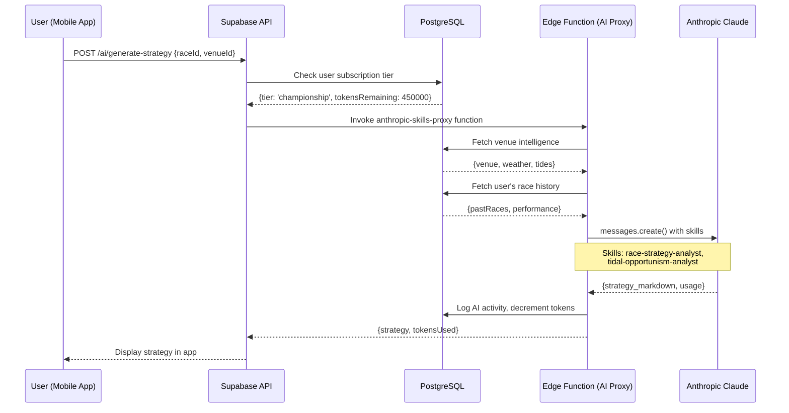
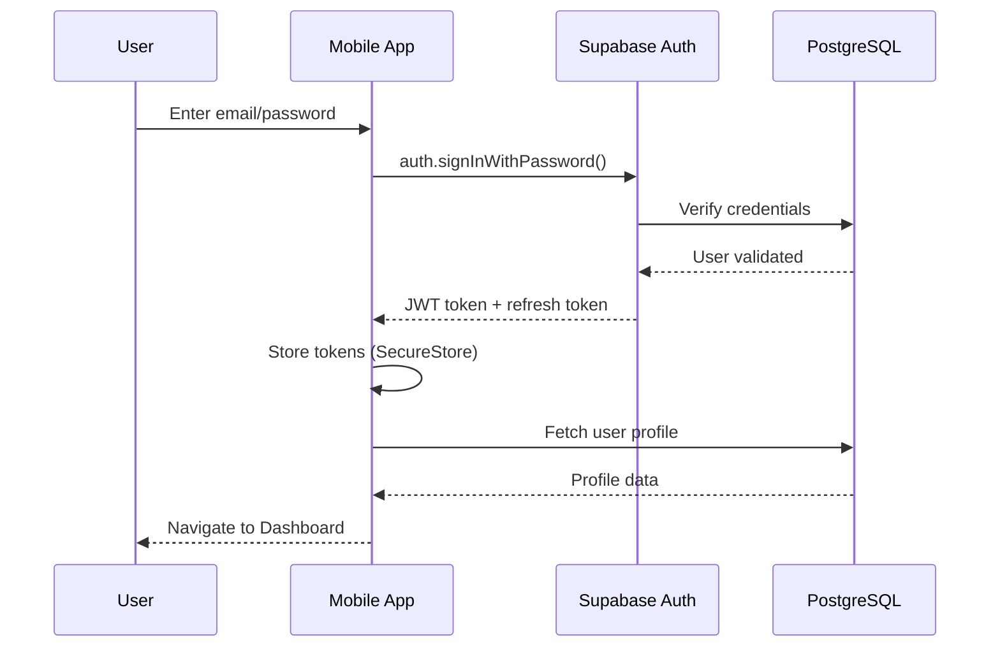

# Technical Architecture Document
## RegattaFlow - System Design & Implementation

**Version**: 1.0
**Last Updated**: 2025-11-10
**Document Owner**: Engineering Team
**Status**: Active Development

---

## Table of Contents

1. [System Overview](#system-overview)
2. [Technology Stack](#technology-stack)
3. [System Architecture](#system-architecture)
4. [Database Architecture](#database-architecture)
5. [Application Architecture](#application-architecture)
6. [Multi-Tenancy Design](#multi-tenancy-design)
7. [Offline-First Architecture](#offline-first-architecture)
8. [Real-Time Architecture](#real-time-architecture)
9. [Authentication & Authorization](#authentication--authorization)
10. [API Design](#api-design)
11. [State Management](#state-management)
12. [Build & Deployment](#build--deployment)
13. [Monitoring & Analytics](#monitoring--analytics)
14. [Scalability & Performance](#scalability--performance)
15. [Security Architecture](#security-architecture)

---

## System Overview

### High-Level Architecture

```
┌─────────────────────────────────────────────────────────────────┐
│                        Client Layer                              │
├──────────────────┬──────────────────┬──────────────────────────┤
│   iOS App        │   Android App     │   Web App (Vercel)       │
│   (Expo/RN)      │   (Expo/RN)      │   (Next.js)              │
└──────────┬───────┴─────────┬─────────┴──────────────┬───────────┘
           │                 │                        │
           └─────────────────┴────────────────────────┘
                             │
                    ┌────────┴────────┐
                    │   API Gateway    │
                    │   (Supabase)     │
                    └────────┬────────┘
                             │
        ┌────────────────────┼────────────────────┐
        │                    │                    │
    ┌───┴───┐         ┌──────┴──────┐      ┌─────┴─────┐
    │       │         │             │      │           │
    │ Auth  │         │  PostgreSQL │      │  Storage  │
    │       │         │   Database  │      │  (Files)  │
    └───────┘         └──────┬──────┘      └───────────┘
                             │
                    ┌────────┴────────┐
                    │  Edge Functions  │
                    │  (Deno Runtime)  │
                    └────────┬────────┘
                             │
        ┌────────────────────┼────────────────────┐
        │                    │                    │
    ┌───┴───────┐    ┌───────┴────────┐   ┌──────┴──────┐
    │           │    │                │   │             │
    │ Anthropic │    │  StormGlass    │   │    Stripe   │
    │  Claude   │    │   (Weather)    │   │  (Payments) │
    └───────────┘    └────────────────┘   └─────────────┘
```

### Component Responsibilities

**Client Layer**:
- Native mobile apps (iOS/Android) built with Expo
- Web marketing site and app (Next.js on Vercel)
- Offline-first data architecture
- Local state management with React Context/Hooks
- SQLite for offline storage

**API Gateway (Supabase)**:
- REST API auto-generated from database schema
- Real-time subscriptions via WebSocket
- Row Level Security (RLS) enforcement
- Connection pooling and caching
- API rate limiting

**Data Layer (PostgreSQL)**:
- Single multi-tenant database
- PostGIS extension for geospatial queries
- Full-text search capabilities
- JSONB for flexible schema fields
- Automated backups and point-in-time recovery

**Edge Functions (Deno)**:
- Serverless functions for custom logic
- AI proxy (secure Anthropic API key management)
- PDF generation (venue reports)
- Background jobs (weather sync, notifications)
- Webhook handlers (Stripe, external services)

**External Services**:
- **Anthropic Claude**: AI coaching and strategy generation
- **StormGlass**: Weather, tides, currents data
- **Stripe**: Payment processing and subscription management
- **Expo Notifications**: Push notification delivery

---

## Technology Stack

### Frontend

**Framework**: Expo SDK 51+
- **Why**: Write once, deploy to iOS, Android, and Web
- **Benefits**: Rapid development, OTA updates, strong ecosystem

**Language**: TypeScript 5.3+
- **Why**: Type safety, better developer experience
- **Configuration**: Strict mode enabled

**UI Library**: React Native 0.74+
- **Custom Components**: Tailored to sailing use cases
- **Design System**: Centralized in `constants/RacingDesignSystem.ts`

**Navigation**: Expo Router (file-based routing)
- **Why**: Declarative, type-safe navigation
- **Structure**: Follows Next.js-style routing

**Maps & Visualization**:
- **deck.gl**: 3D WebGL visualizations (bathymetry, weather)
- **React Native Maps**: Basic 2D maps
- **Victory Native**: Charts and graphs

**State Management**:
- React Context API for global state
- React Hooks for local state
- Zustand for complex state (optional, used in stores/)

**Offline Storage**:
- **expo-sqlite**: Local SQLite database
- **expo-file-system**: File caching
- **MMKV**: Fast key-value storage (metadata)

### Backend

**Database**: Supabase (PostgreSQL 15+)
- **Extensions**:
  - PostGIS (geospatial queries)
  - pg_cron (scheduled jobs)
  - pg_stat_statements (query analytics)
  - pgvector (AI embeddings, future)

**Edge Functions**: Supabase Functions (Deno runtime)
- **Language**: TypeScript
- **Benefits**: V8 isolates, fast cold starts, secure

**Authentication**: Supabase Auth
- **Methods**: Email/password, Google OAuth, Apple Sign In
- **Token**: JWT with 1-hour expiration

**Storage**: Supabase Storage
- **CDN**: Integrated CDN for static assets
- **Policies**: RLS-based access control

**Real-Time**: Supabase Realtime
- **Protocol**: WebSocket (Phoenix Channels)
- **Features**: Database change streams, presence, broadcast

### External Services

**AI/ML**:
- Anthropic Claude 3.5 Sonnet
- Custom MCP skills (15+ sailing-specific)

**Weather**:
- StormGlass API (primary)
- Surf MCP (secondary, for testing)

**Payments**:
- Stripe Checkout
- Stripe Customer Portal
- Stripe Webhooks

**Analytics**:
- Mixpanel (user behavior)
- Sentry (error tracking)
- Expo Analytics (app performance)

**Deployment**:
- Expo EAS (mobile apps)
- Vercel (web/marketing site)
- GitHub Actions (CI/CD)

---

## System Architecture

### Deployment Architecture

```
┌─────────────────────────────────────────────────────────────────┐
│                          Production                              │
└─────────────────────────────────────────────────────────────────┘

┌────────────────┐
│   GitHub Repo  │
│   (Main Branch)│
└────────┬───────┘
         │
    ┌────┴─────────────────────────────────┐
    │                                      │
┌───┴──────┐                        ┌─────┴──────┐
│  Vercel  │                        │  Expo EAS  │
│  Deploy  │                        │   Build    │
└───┬──────┘                        └─────┬──────┘
    │                                     │
┌───┴────────────┐              ┌─────────┴──────────┐
│  Web App       │              │  Mobile Apps       │
│  (Next.js)     │              │  iOS + Android     │
│                │              │                    │
│ - Marketing    │              │ - Native apps      │
│ - Docs         │              │ - OTA updates      │
│ - Course       │              │ - Push notifs      │
│   viewer       │              │                    │
└────────────────┘              └────────────────────┘


┌─────────────────────────────────────────────────────────────────┐
│                      Supabase Project                            │
│                   (regattaflow-production)                       │
├──────────────┬──────────────┬──────────────┬────────────────────┤
│              │              │              │                    │
│  PostgreSQL  │  Auth Server │  Storage     │  Edge Functions    │
│  Database    │              │  Buckets     │  (Deno)            │
│              │              │              │                    │
│  - 147+      │  - JWT       │  - Venue     │  - AI proxy        │
│    venues    │    tokens    │    photos    │  - Weather sync    │
│  - Multi-    │  - OAuth     │  - PDFs      │  - Scoring         │
│    tenant    │  - Sessions  │  - Logos     │  - Notifications   │
│  - RLS       │              │  - RLS       │  - Webhooks        │
│                                                                  │
└──────────────────────────────────────────────────────────────────┘
```

### Data Flow - Example: Generate Race Strategy



### Multi-Region Considerations

**Current**: Single region (EU or US based on customer base)

**Future Multi-Region**:
- Primary region: EU (GDPR compliance)
- Secondary region: US (lower latency for US customers)
- Read replicas in both regions
- Supabase Edge Functions at global edge locations

---

## Database Architecture

### Entity Relationship Diagram (Core Tables)

```
┌─────────────────┐
│   auth.users    │
│  (Supabase)     │
└────────┬────────┘
         │
    ┌────┴─────────────────────────┐
    │                              │
┌───┴──────────────┐     ┌─────────┴──────────┐
│ sailor_profiles  │     │  coach_profiles    │
│                  │     │                    │
│ - boat_class     │     │ - certifications   │
│ - home_club      │     │ - hourly_rate      │
│ - experience     │     │ - specialties      │
└────────┬─────────┘     └─────────┬──────────┘
         │                         │
         │              ┌──────────┴──────────┐
         │              │ coaching_sessions   │
         │              │                     │
         │              │ - session_type      │
         │              │ - date_time         │
         │              │ - status            │
         │              └─────────────────────┘
         │
    ┌────┴─────────────────────┐
    │                          │
┌───┴──────────┐     ┌─────────┴──────────┐
│subscriptions │     │ race_participants  │
│              │     │                    │
│ - tier       │     │ - championship_id  │
│ - status     │     │ - boat_name        │
│ - stripe_*   │     │ - sail_number      │
└──────────────┘     └──────┬─────────────┘
                            │
                     ┌──────┴─────────┐
                     │ championships  │
                     │                │
                     │ - organizer_id │
                     │ - venue_id     │
                     │ - app_config   │
                     └──────┬─────────┘
                            │
        ┌───────────────────┼───────────────────┐
        │                   │                   │
┌───────┴──────────┐  ┌─────┴────────┐  ┌──────┴─────────┐
│ championship_    │  │championship_ │  │ championship_  │
│   schedule       │  │   notices    │  │   roles        │
│                  │  │              │  │                │
│ - race_date      │  │ - title      │  │ - user_id      │
│ - scheduled_time │  │ - priority   │  │ - role         │
└───────┬──────────┘  └──────────────┘  └────────────────┘
        │
    ┌───┴─────┐
    │  races  │
    │         │
    │ - race_ │
    │   number│
    └───┬─────┘
        │
    ┌───┴──────────────┐
    │  race_results    │
    │                  │
    │ - finish_position│
    │ - points_scored  │
    └──────────────────┘


┌─────────────┐
│   venues    │
│             │
│ - name      │
│ - location  │ (PostGIS GEOGRAPHY)
│ - weather_  │
│   data      │
└─────┬───────┘
      │
  ┌───┴─────────────────┐
  │  bathymetry_tiles   │
  │                     │
  │ - zoom_level        │
  │ - tile_x, tile_y    │
  │ - depth_data        │
  └─────────────────────┘
```

### Complete Database Schema

```sql
-- ============================================================================
-- CORE USER TABLES
-- ============================================================================

-- Sailor profiles (extends auth.users)
CREATE TABLE sailor_profiles (
  id UUID PRIMARY KEY REFERENCES auth.users(id) ON DELETE CASCADE,
  full_name TEXT NOT NULL,
  avatar_url TEXT,
  boat_class TEXT,
  home_club TEXT,
  home_region TEXT,
  experience_level TEXT CHECK (experience_level IN ('beginner', 'intermediate', 'advanced', 'expert')),
  years_sailing INTEGER,
  bio TEXT,
  emergency_contact JSONB,
  metadata JSONB,
  created_at TIMESTAMPTZ DEFAULT NOW(),
  updated_at TIMESTAMPTZ DEFAULT NOW()
);

-- Coach profiles (extends auth.users)
CREATE TABLE coach_profiles (
  id UUID PRIMARY KEY REFERENCES auth.users(id) ON DELETE CASCADE,
  certifications TEXT[],
  specialties TEXT[],
  boat_classes TEXT[],
  hourly_rate_eur INTEGER,
  availability JSONB,
  total_sessions INTEGER DEFAULT 0,
  average_rating DECIMAL(3,2),
  bio TEXT,
  video_intro_url TEXT,
  metadata JSONB,
  created_at TIMESTAMPTZ DEFAULT NOW(),
  updated_at TIMESTAMPTZ DEFAULT NOW()
);

-- Organizer profiles (extends auth.users)
CREATE TABLE organizer_profiles (
  id UUID PRIMARY KEY REFERENCES auth.users(id) ON DELETE CASCADE,
  organization_name TEXT,
  role TEXT CHECK (role IN ('race_officer', 'technical_delegate', 'club_manager', 'event_organizer')),
  championships_managed INTEGER DEFAULT 0,
  contact_email TEXT,
  contact_phone TEXT,
  created_at TIMESTAMPTZ DEFAULT NOW()
);

-- ============================================================================
-- SUBSCRIPTION & BILLING
-- ============================================================================

CREATE TABLE subscriptions (
  id UUID PRIMARY KEY DEFAULT gen_random_uuid(),
  user_id UUID NOT NULL REFERENCES auth.users(id) ON DELETE CASCADE,
  stripe_subscription_id TEXT UNIQUE,
  stripe_customer_id TEXT,
  tier TEXT CHECK (tier IN ('free', 'pro', 'championship')) DEFAULT 'free',
  status TEXT CHECK (status IN ('active', 'trialing', 'past_due', 'canceled', 'incomplete', 'incomplete_expired')),
  current_period_start TIMESTAMPTZ,
  current_period_end TIMESTAMPTZ,
  trial_start TIMESTAMPTZ,
  trial_end TIMESTAMPTZ,
  cancel_at TIMESTAMPTZ,
  canceled_at TIMESTAMPTZ,
  metadata JSONB,
  created_at TIMESTAMPTZ DEFAULT NOW(),
  updated_at TIMESTAMPTZ DEFAULT NOW(),
  UNIQUE(user_id)
);

CREATE TABLE invoices (
  id UUID PRIMARY KEY DEFAULT gen_random_uuid(),
  user_id UUID NOT NULL REFERENCES auth.users(id),
  stripe_invoice_id TEXT UNIQUE,
  amount_eur INTEGER NOT NULL,
  currency TEXT DEFAULT 'eur',
  status TEXT CHECK (status IN ('draft', 'open', 'paid', 'void', 'uncollectible')),
  invoice_pdf TEXT,
  paid_at TIMESTAMPTZ,
  created_at TIMESTAMPTZ DEFAULT NOW()
);

-- ============================================================================
-- VENUES & WEATHER
-- ============================================================================

CREATE TABLE venues (
  id UUID PRIMARY KEY DEFAULT gen_random_uuid(),
  name TEXT NOT NULL,
  slug TEXT UNIQUE NOT NULL,
  location GEOGRAPHY(POINT, 4326) NOT NULL,
  city TEXT,
  country TEXT,
  country_code TEXT,
  water_type TEXT CHECK (water_type IN ('harbor', 'bay', 'ocean', 'lake', 'river')),
  description TEXT,
  characteristics JSONB,
  photos TEXT[],
  weather_data JSONB,
  tidal_data JSONB,
  bathymetry_available BOOLEAN DEFAULT false,
  race_area_boundaries GEOGRAPHY(POLYGON, 4326),
  typical_wind_direction INTEGER, -- degrees
  typical_wind_speed INTEGER, -- knots
  popularity_score INTEGER DEFAULT 0,
  metadata JSONB,
  created_at TIMESTAMPTZ DEFAULT NOW(),
  updated_at TIMESTAMPTZ DEFAULT NOW()
);

CREATE INDEX idx_venues_location ON venues USING GIST(location);
CREATE INDEX idx_venues_slug ON venues(slug);
CREATE INDEX idx_venues_popularity ON venues(popularity_score DESC);
CREATE INDEX idx_venues_country ON venues(country);

CREATE TABLE venue_favorites (
  id UUID PRIMARY KEY DEFAULT gen_random_uuid(),
  user_id UUID NOT NULL REFERENCES auth.users(id) ON DELETE CASCADE,
  venue_id UUID NOT NULL REFERENCES venues(id) ON DELETE CASCADE,
  list_name TEXT DEFAULT 'default',
  created_at TIMESTAMPTZ DEFAULT NOW(),
  UNIQUE(user_id, venue_id)
);

CREATE TABLE weather_cache (
  id UUID PRIMARY KEY DEFAULT gen_random_uuid(),
  venue_id UUID REFERENCES venues(id),
  latitude DECIMAL(10, 7),
  longitude DECIMAL(10, 7),
  timestamp TIMESTAMPTZ NOT NULL,
  forecast_data JSONB,
  source TEXT DEFAULT 'stormglass',
  expires_at TIMESTAMPTZ,
  created_at TIMESTAMPTZ DEFAULT NOW(),
  UNIQUE(venue_id, timestamp)
);

CREATE INDEX idx_weather_venue_timestamp ON weather_cache(venue_id, timestamp DESC);
CREATE INDEX idx_weather_expires ON weather_cache(expires_at);

CREATE TABLE bathymetry_tiles (
  id UUID PRIMARY KEY DEFAULT gen_random_uuid(),
  venue_id UUID NOT NULL REFERENCES venues(id) ON DELETE CASCADE,
  zoom_level INTEGER NOT NULL,
  tile_x INTEGER NOT NULL,
  tile_y INTEGER NOT NULL,
  depth_data BYTEA, -- Compressed elevation data
  format TEXT DEFAULT 'pmtiles',
  metadata JSONB,
  created_at TIMESTAMPTZ DEFAULT NOW(),
  UNIQUE(venue_id, zoom_level, tile_x, tile_y)
);

CREATE INDEX idx_bathymetry_venue_zoom ON bathymetry_tiles(venue_id, zoom_level);

-- ============================================================================
-- CHAMPIONSHIPS (Multi-Tenant)
-- ============================================================================

CREATE TABLE championships (
  id UUID PRIMARY KEY DEFAULT gen_random_uuid(),
  organizer_id UUID NOT NULL REFERENCES auth.users(id),
  name TEXT NOT NULL,
  slug TEXT UNIQUE NOT NULL,
  start_date DATE NOT NULL,
  end_date DATE NOT NULL,
  venue_id UUID REFERENCES venues(id),
  boat_class TEXT,
  expected_competitors INTEGER,
  app_config JSONB NOT NULL DEFAULT '{}',
  build_status TEXT CHECK (build_status IN ('draft', 'building', 'published', 'archived')) DEFAULT 'draft',
  ios_bundle_id TEXT,
  android_package_name TEXT,
  app_store_url TEXT,
  play_store_url TEXT,
  qr_code_url TEXT,
  metadata JSONB,
  created_at TIMESTAMPTZ DEFAULT NOW(),
  updated_at TIMESTAMPTZ DEFAULT NOW()
);

CREATE INDEX idx_championships_organizer ON championships(organizer_id);
CREATE INDEX idx_championships_dates ON championships(start_date, end_date);
CREATE INDEX idx_championships_venue ON championships(venue_id);

CREATE TABLE championship_roles (
  id UUID PRIMARY KEY DEFAULT gen_random_uuid(),
  championship_id UUID NOT NULL REFERENCES championships(id) ON DELETE CASCADE,
  user_id UUID NOT NULL REFERENCES auth.users(id) ON DELETE CASCADE,
  role TEXT CHECK (role IN ('admin', 'race_officer', 'technical_delegate', 'media', 'viewer')) NOT NULL,
  permissions JSONB,
  created_at TIMESTAMPTZ DEFAULT NOW(),
  UNIQUE(championship_id, user_id)
);

CREATE TABLE race_participants (
  id UUID PRIMARY KEY DEFAULT gen_random_uuid(),
  championship_id UUID NOT NULL REFERENCES championships(id) ON DELETE CASCADE,
  user_id UUID REFERENCES auth.users(id) ON DELETE SET NULL,
  boat_name TEXT NOT NULL,
  sail_number TEXT NOT NULL,
  skipper_name TEXT NOT NULL,
  division TEXT,
  fleet_id UUID REFERENCES fleets(id),
  crew JSONB,
  boat_details JSONB,
  status TEXT CHECK (status IN ('registered', 'confirmed', 'withdrawn', 'disqualified')) DEFAULT 'registered',
  visibility TEXT CHECK (visibility IN ('public', 'fleet', 'private')) DEFAULT 'public',
  registration_date TIMESTAMPTZ DEFAULT NOW(),
  metadata JSONB,
  created_at TIMESTAMPTZ DEFAULT NOW(),
  updated_at TIMESTAMPTZ DEFAULT NOW(),
  UNIQUE(championship_id, sail_number, division)
);

CREATE INDEX idx_participants_championship ON race_participants(championship_id);
CREATE INDEX idx_participants_user ON race_participants(user_id);
CREATE INDEX idx_participants_fleet ON race_participants(fleet_id);

-- ============================================================================
-- SCHEDULE & NOTICES
-- ============================================================================

CREATE TABLE championship_schedule (
  id UUID PRIMARY KEY DEFAULT gen_random_uuid(),
  championship_id UUID NOT NULL REFERENCES championships(id) ON DELETE CASCADE,
  race_date DATE NOT NULL,
  scheduled_time TIME,
  race_number INTEGER,
  division TEXT,
  course_config JSONB,
  status TEXT CHECK (status IN ('scheduled', 'postponed', 'in_progress', 'completed', 'cancelled')) DEFAULT 'scheduled',
  postponement_reason TEXT,
  created_at TIMESTAMPTZ DEFAULT NOW(),
  updated_at TIMESTAMPTZ DEFAULT NOW()
);

CREATE INDEX idx_schedule_championship_date ON championship_schedule(championship_id, race_date);

CREATE TABLE championship_notices (
  id UUID PRIMARY KEY DEFAULT gen_random_uuid(),
  championship_id UUID NOT NULL REFERENCES championships(id) ON DELETE CASCADE,
  posted_by UUID REFERENCES auth.users(id),
  title TEXT NOT NULL,
  body TEXT NOT NULL,
  priority TEXT CHECK (priority IN ('normal', 'important', 'urgent')) DEFAULT 'normal',
  target_audience JSONB, -- {divisions: [], boats: []}
  attachments TEXT[],
  read_receipts JSONB, -- {user_id: timestamp}
  posted_at TIMESTAMPTZ DEFAULT NOW(),
  expires_at TIMESTAMPTZ,
  created_at TIMESTAMPTZ DEFAULT NOW()
);

CREATE INDEX idx_notices_championship ON championship_notices(championship_id);
CREATE INDEX idx_notices_posted_at ON championship_notices(posted_at DESC);

-- ============================================================================
-- RACE RESULTS & STANDINGS
-- ============================================================================

CREATE TABLE races (
  id UUID PRIMARY KEY DEFAULT gen_random_uuid(),
  championship_id UUID NOT NULL REFERENCES championships(id) ON DELETE CASCADE,
  race_number INTEGER NOT NULL,
  race_date DATE,
  scheduled_time TIME,
  division TEXT,
  course_config JSONB,
  status TEXT CHECK (status IN ('scheduled', 'in_progress', 'completed', 'postponed', 'cancelled')) DEFAULT 'scheduled',
  weather_conditions JSONB,
  start_time TIMESTAMPTZ,
  finish_time TIMESTAMPTZ,
  results_status TEXT CHECK (results_status IN ('pending', 'provisional', 'final')) DEFAULT 'pending',
  protest_deadline TIMESTAMPTZ,
  metadata JSONB,
  created_at TIMESTAMPTZ DEFAULT NOW(),
  updated_at TIMESTAMPTZ DEFAULT NOW(),
  UNIQUE(championship_id, race_number, division)
);

CREATE INDEX idx_races_championship ON races(championship_id);
CREATE INDEX idx_races_date ON races(race_date);

CREATE TABLE race_results (
  id UUID PRIMARY KEY DEFAULT gen_random_uuid(),
  race_id UUID NOT NULL REFERENCES races(id) ON DELETE CASCADE,
  competitor_id UUID NOT NULL REFERENCES race_participants(id),
  finish_position INTEGER,
  finish_time TIME,
  status_code TEXT DEFAULT 'OK', -- OK, DNF, DNS, DSQ, OCS, RAF, BFD, etc.
  penalty_points INTEGER DEFAULT 0,
  points_scored DECIMAL(5,2),
  notes TEXT,
  created_at TIMESTAMPTZ DEFAULT NOW(),
  updated_at TIMESTAMPTZ DEFAULT NOW(),
  UNIQUE(race_id, competitor_id)
);

CREATE INDEX idx_results_race ON race_results(race_id);
CREATE INDEX idx_results_competitor ON race_results(competitor_id);

CREATE TABLE series_standings (
  id UUID PRIMARY KEY DEFAULT gen_random_uuid(),
  championship_id UUID NOT NULL REFERENCES championships(id) ON DELETE CASCADE,
  competitor_id UUID NOT NULL REFERENCES race_participants(id),
  division TEXT,
  total_points DECIMAL(7,2) NOT NULL,
  races_completed INTEGER DEFAULT 0,
  dropped_races INTEGER[],
  position INTEGER,
  tie_breaker_position INTEGER,
  last_updated TIMESTAMPTZ DEFAULT NOW(),
  UNIQUE(championship_id, competitor_id)
);

CREATE INDEX idx_standings_championship_position ON series_standings(championship_id, position);

-- ============================================================================
-- COURSE & MARKS
-- ============================================================================

CREATE TABLE race_courses (
  id UUID PRIMARY KEY DEFAULT gen_random_uuid(),
  championship_id UUID REFERENCES championships(id),
  venue_id UUID REFERENCES venues(id),
  name TEXT NOT NULL,
  description TEXT,
  course_type TEXT, -- 'windward-leeward', 'triangle', 'trapezoid', 'custom'
  marks JSONB, -- [{name, lat, lng, type}]
  legs JSONB, -- [{from_mark, to_mark, type}]
  metadata JSONB,
  created_at TIMESTAMPTZ DEFAULT NOW(),
  updated_at TIMESTAMPTZ DEFAULT NOW()
);

CREATE TABLE race_marks (
  id UUID PRIMARY KEY DEFAULT gen_random_uuid(),
  course_id UUID NOT NULL REFERENCES race_courses(id) ON DELETE CASCADE,
  name TEXT NOT NULL,
  mark_type TEXT CHECK (mark_type IN ('start', 'windward', 'leeward', 'offset', 'gate', 'finish')),
  location GEOGRAPHY(POINT, 4326) NOT NULL,
  rounding_direction TEXT CHECK (rounding_direction IN ('port', 'starboard', 'either')),
  sequence INTEGER,
  metadata JSONB,
  created_at TIMESTAMPTZ DEFAULT NOW()
);

-- ============================================================================
-- LOGISTICS
-- ============================================================================

CREATE TABLE boat_shipments (
  id UUID PRIMARY KEY DEFAULT gen_random_uuid(),
  championship_id UUID NOT NULL REFERENCES championships(id),
  competitor_id UUID REFERENCES race_participants(id),
  boat_name TEXT NOT NULL,
  origin_location TEXT,
  shipping_method TEXT CHECK (shipping_method IN ('container', 'air', 'truck', 'self_transport')),
  carrier TEXT,
  tracking_number TEXT,
  expected_arrival DATE,
  status TEXT CHECK (status IN ('pending', 'in_transit', 'customs', 'arrived', 'ready_for_pickup', 'issue')) DEFAULT 'pending',
  current_location TEXT,
  last_update TIMESTAMPTZ,
  timeline JSONB, -- [{timestamp, status, location, notes}]
  issues JSONB,
  created_at TIMESTAMPTZ DEFAULT NOW(),
  updated_at TIMESTAMPTZ DEFAULT NOW()
);

CREATE INDEX idx_shipments_championship ON boat_shipments(championship_id);
CREATE INDEX idx_shipments_status ON boat_shipments(status);

-- ============================================================================
-- AI & COACHING
-- ============================================================================

CREATE TABLE ai_race_strategies (
  id UUID PRIMARY KEY DEFAULT gen_random_uuid(),
  user_id UUID NOT NULL REFERENCES auth.users(id),
  race_id UUID REFERENCES races(id),
  venue_id UUID REFERENCES venues(id),
  strategy_markdown TEXT NOT NULL,
  skills_used TEXT[],
  context_data JSONB,
  user_feedback JSONB,
  generated_at TIMESTAMPTZ DEFAULT NOW()
);

CREATE INDEX idx_strategies_user ON ai_race_strategies(user_id);
CREATE INDEX idx_strategies_race ON ai_race_strategies(race_id);

CREATE TABLE ai_activity (
  id UUID PRIMARY KEY DEFAULT gen_random_uuid(),
  user_id UUID NOT NULL REFERENCES auth.users(id),
  activity_type TEXT CHECK (activity_type IN ('strategy', 'coaching', 'analysis', 'chat', 'tuning')),
  skill_name TEXT,
  input_data JSONB,
  output_data JSONB,
  tokens_used INTEGER,
  cost_usd DECIMAL(10,4),
  created_at TIMESTAMPTZ DEFAULT NOW()
);

CREATE INDEX idx_ai_activity_user_created ON ai_activity(user_id, created_at DESC);

CREATE TABLE coaching_sessions (
  id UUID PRIMARY KEY DEFAULT gen_random_uuid(),
  coach_id UUID NOT NULL REFERENCES coach_profiles(id),
  sailor_id UUID NOT NULL REFERENCES sailor_profiles(id),
  session_type TEXT CHECK (session_type IN ('on_water', 'video_analysis', 'group_clinic', 'online_call')),
  scheduled_date TIMESTAMPTZ NOT NULL,
  duration_minutes INTEGER DEFAULT 60,
  location TEXT,
  price_eur INTEGER NOT NULL,
  status TEXT CHECK (status IN ('pending', 'confirmed', 'completed', 'cancelled')) DEFAULT 'pending',
  notes TEXT,
  payment_status TEXT CHECK (payment_status IN ('pending', 'paid', 'refunded')) DEFAULT 'pending',
  stripe_payment_intent_id TEXT,
  created_at TIMESTAMPTZ DEFAULT NOW(),
  updated_at TIMESTAMPTZ DEFAULT NOW()
);

CREATE INDEX idx_coaching_coach ON coaching_sessions(coach_id);
CREATE INDEX idx_coaching_sailor ON coaching_sessions(sailor_id);
CREATE INDEX idx_coaching_date ON coaching_sessions(scheduled_date);

-- ============================================================================
-- FLEET MANAGEMENT
-- ============================================================================

CREATE TABLE fleets (
  id UUID PRIMARY KEY DEFAULT gen_random_uuid(),
  name TEXT NOT NULL,
  description TEXT,
  boat_class TEXT,
  region TEXT,
  visibility TEXT CHECK (visibility IN ('public', 'private', 'invite_only')) DEFAULT 'public',
  admin_id UUID NOT NULL REFERENCES auth.users(id),
  whatsapp_link TEXT,
  member_count INTEGER DEFAULT 0,
  metadata JSONB,
  created_at TIMESTAMPTZ DEFAULT NOW(),
  updated_at TIMESTAMPTZ DEFAULT NOW()
);

CREATE TABLE fleet_members (
  id UUID PRIMARY KEY DEFAULT gen_random_uuid(),
  fleet_id UUID NOT NULL REFERENCES fleets(id) ON DELETE CASCADE,
  user_id UUID NOT NULL REFERENCES auth.users(id) ON DELETE CASCADE,
  role TEXT CHECK (role IN ('admin', 'member')) DEFAULT 'member',
  status TEXT CHECK (status IN ('active', 'inactive', 'pending')) DEFAULT 'active',
  joined_at TIMESTAMPTZ DEFAULT NOW(),
  UNIQUE(fleet_id, user_id)
);

CREATE INDEX idx_fleet_members_fleet ON fleet_members(fleet_id);
CREATE INDEX idx_fleet_members_user ON fleet_members(user_id);

-- ============================================================================
-- DOCUMENTS
-- ============================================================================

CREATE TABLE race_documents (
  id UUID PRIMARY KEY DEFAULT gen_random_uuid(),
  championship_id UUID NOT NULL REFERENCES championships(id) ON DELETE CASCADE,
  uploaded_by UUID REFERENCES auth.users(id),
  document_type TEXT CHECK (document_type IN ('sailing_instructions', 'notice_of_race', 'amendment', 'results', 'other')),
  filename TEXT NOT NULL,
  file_url TEXT NOT NULL,
  file_size INTEGER,
  mime_type TEXT,
  ai_extracted_data JSONB,
  is_official BOOLEAN DEFAULT false,
  version INTEGER DEFAULT 1,
  created_at TIMESTAMPTZ DEFAULT NOW()
);

CREATE INDEX idx_documents_championship ON race_documents(championship_id);

-- ============================================================================
-- LEARNING PLATFORM
-- ============================================================================

CREATE TABLE courses (
  id UUID PRIMARY KEY DEFAULT gen_random_uuid(),
  title TEXT NOT NULL,
  slug TEXT UNIQUE NOT NULL,
  description TEXT,
  instructor_id UUID REFERENCES coach_profiles(id),
  difficulty TEXT CHECK (difficulty IN ('beginner', 'intermediate', 'advanced')),
  duration_minutes INTEGER,
  price_eur INTEGER DEFAULT 0,
  thumbnail_url TEXT,
  trailer_url TEXT,
  topics TEXT[],
  boat_classes TEXT[],
  is_published BOOLEAN DEFAULT false,
  average_rating DECIMAL(3,2),
  total_enrollments INTEGER DEFAULT 0,
  created_at TIMESTAMPTZ DEFAULT NOW(),
  updated_at TIMESTAMPTZ DEFAULT NOW()
);

CREATE TABLE course_lessons (
  id UUID PRIMARY KEY DEFAULT gen_random_uuid(),
  course_id UUID NOT NULL REFERENCES courses(id) ON DELETE CASCADE,
  title TEXT NOT NULL,
  description TEXT,
  video_url TEXT,
  duration_minutes INTEGER,
  resources JSONB, -- [{name, url, type}]
  sequence INTEGER NOT NULL,
  is_preview BOOLEAN DEFAULT false,
  created_at TIMESTAMPTZ DEFAULT NOW()
);

CREATE INDEX idx_lessons_course_sequence ON course_lessons(course_id, sequence);

CREATE TABLE course_enrollments (
  id UUID PRIMARY KEY DEFAULT gen_random_uuid(),
  user_id UUID NOT NULL REFERENCES auth.users(id),
  course_id UUID NOT NULL REFERENCES courses(id),
  enrolled_at TIMESTAMPTZ DEFAULT NOW(),
  completed_at TIMESTAMPTZ,
  progress_percent INTEGER DEFAULT 0,
  last_accessed_at TIMESTAMPTZ,
  UNIQUE(user_id, course_id)
);

CREATE TABLE course_progress (
  id UUID PRIMARY KEY DEFAULT gen_random_uuid(),
  enrollment_id UUID NOT NULL REFERENCES course_enrollments(id) ON DELETE CASCADE,
  lesson_id UUID NOT NULL REFERENCES course_lessons(id),
  completed BOOLEAN DEFAULT false,
  completed_at TIMESTAMPTZ,
  watch_time_seconds INTEGER DEFAULT 0,
  UNIQUE(enrollment_id, lesson_id)
);

-- ============================================================================
-- INDEXES FOR PERFORMANCE
-- ============================================================================

-- Composite indexes for common queries
CREATE INDEX idx_race_results_position ON race_results(race_id, finish_position) WHERE status_code = 'OK';
CREATE INDEX idx_subscriptions_user_status ON subscriptions(user_id, status);
CREATE INDEX idx_races_championship_status ON races(championship_id, status);
CREATE INDEX idx_participants_championship_status ON race_participants(championship_id, status);

-- Full-text search indexes
CREATE INDEX idx_venues_name_search ON venues USING gin(to_tsvector('english', name));
CREATE INDEX idx_championships_name_search ON championships USING gin(to_tsvector('english', name));
```

### Row Level Security (RLS) Policies

**Principle**: Enable RLS on all tables, deny by default

```sql
-- ============================================================================
-- RLS POLICIES
-- ============================================================================

-- Enable RLS on all tables
ALTER TABLE sailor_profiles ENABLE ROW LEVEL SECURITY;
ALTER TABLE coach_profiles ENABLE ROW LEVEL SECURITY;
ALTER TABLE subscriptions ENABLE ROW LEVEL SECURITY;
ALTER TABLE venues ENABLE ROW LEVEL SECURITY;
ALTER TABLE championships ENABLE ROW LEVEL SECURITY;
ALTER TABLE race_participants ENABLE ROW LEVEL SECURITY;
ALTER TABLE championship_schedule ENABLE ROW LEVEL SECURITY;
ALTER TABLE championship_notices ENABLE ROW LEVEL SECURITY;
ALTER TABLE races ENABLE ROW LEVEL SECURITY;
ALTER TABLE race_results ENABLE ROW LEVEL SECURITY;
-- ... (enable on all tables)

-- Example policies:

-- Sailor Profiles
CREATE POLICY "Users can view own profile"
  ON sailor_profiles FOR SELECT
  USING (auth.uid() = id);

CREATE POLICY "Users can update own profile"
  ON sailor_profiles FOR UPDATE
  USING (auth.uid() = id);

-- Venues (tier-based access)
CREATE POLICY "Pro/Championship users can access all venues"
  ON venues FOR SELECT
  USING (
    EXISTS (
      SELECT 1 FROM subscriptions
      WHERE user_id = auth.uid()
      AND tier IN ('pro', 'championship')
      AND status = 'active'
    )
  );

CREATE POLICY "Free users can access favorited venues"
  ON venues FOR SELECT
  USING (
    EXISTS (
      SELECT 1 FROM venue_favorites
      WHERE user_id = auth.uid() AND venue_id = venues.id
    )
  );

-- Championships (organizer access)
CREATE POLICY "Organizers can manage their championships"
  ON championships FOR ALL
  USING (
    organizer_id = auth.uid() OR
    EXISTS (
      SELECT 1 FROM championship_roles
      WHERE championship_id = championships.id
      AND user_id = auth.uid()
      AND role IN ('admin', 'race_officer', 'technical_delegate')
    )
  );

-- Championship participants can view
CREATE POLICY "Participants can view championship"
  ON championships FOR SELECT
  USING (
    EXISTS (
      SELECT 1 FROM race_participants
      WHERE championship_id = championships.id
      AND user_id = auth.uid()
    )
  );

-- Schedule (participants can view, organizers can edit)
CREATE POLICY "Participants can view schedule"
  ON championship_schedule FOR SELECT
  USING (
    EXISTS (
      SELECT 1 FROM race_participants
      WHERE championship_id = championship_schedule.championship_id
      AND user_id = auth.uid()
    )
  );

CREATE POLICY "Organizers can manage schedule"
  ON championship_schedule FOR ALL
  USING (
    EXISTS (
      SELECT 1 FROM championship_roles cr
      JOIN championships c ON c.id = cr.championship_id
      WHERE c.id = championship_schedule.championship_id
      AND cr.user_id = auth.uid()
      AND cr.role IN ('admin', 'race_officer')
    )
  );

-- Results (public read, organizer write)
CREATE POLICY "Anyone can view published results"
  ON race_results FOR SELECT
  USING (
    EXISTS (
      SELECT 1 FROM races
      WHERE id = race_results.race_id
      AND results_status IN ('provisional', 'final')
    )
  );

CREATE POLICY "Race officers can manage results"
  ON race_results FOR ALL
  USING (
    EXISTS (
      SELECT 1 FROM races r
      JOIN championship_roles cr ON cr.championship_id = r.championship_id
      WHERE r.id = race_results.race_id
      AND cr.user_id = auth.uid()
      AND cr.role IN ('admin', 'race_officer')
    )
  );
```

### Database Functions & Triggers

```sql
-- Auto-update updated_at timestamp
CREATE OR REPLACE FUNCTION update_updated_at_column()
RETURNS TRIGGER AS $$
BEGIN
  NEW.updated_at = NOW();
  RETURN NEW;
END;
$$ language 'plpgsql';

-- Apply to all tables with updated_at
CREATE TRIGGER update_sailor_profiles_updated_at
  BEFORE UPDATE ON sailor_profiles
  FOR EACH ROW EXECUTE FUNCTION update_updated_at_column();

CREATE TRIGGER update_championships_updated_at
  BEFORE UPDATE ON championships
  FOR EACH ROW EXECUTE FUNCTION update_updated_at_column();

-- ... (apply to all relevant tables)

-- Calculate series standings when race results change
CREATE OR REPLACE FUNCTION recalculate_series_standings()
RETURNS TRIGGER AS $$
BEGIN
  -- Trigger scoring service edge function
  PERFORM net.http_post(
    url := current_setting('app.scoring_service_url'),
    body := jsonb_build_object('championship_id', (
      SELECT championship_id FROM races WHERE id = NEW.race_id
    ))
  );
  RETURN NEW;
END;
$$ language 'plpgsql';

CREATE TRIGGER on_race_results_change
  AFTER INSERT OR UPDATE ON race_results
  FOR EACH ROW EXECUTE FUNCTION recalculate_series_standings();
```

---

## Application Architecture

### Project Structure

```
regattaflow-app/
├── app/                          # Expo Router (file-based routing)
│   ├── (auth)/                   # Authentication screens
│   │   ├── login.tsx
│   │   ├── signup.tsx
│   │   ├── onboarding/
│   │   └── _layout.tsx
│   ├── (tabs)/                   # Main app tabs
│   │   ├── index.tsx             # Dashboard
│   │   ├── races.tsx             # Races list
│   │   ├── map.tsx               # Map view
│   │   ├── coach.tsx             # Coaching
│   │   └── _layout.tsx
│   ├── championship/             # Championship screens
│   │   ├── [id]/
│   │   │   ├── index.tsx
│   │   │   ├── schedule.tsx
│   │   │   ├── notices.tsx
│   │   │   └── results.tsx
│   │   └── _layout.tsx
│   ├── race/                     # Race detail screens
│   │   ├── [id].tsx
│   │   └── timer/
│   ├── venue/                    # Venue screens
│   │   ├── [id].tsx
│   │   └── list.tsx
│   ├── organizer/                # Organizer portal
│   │   ├── dashboard.tsx
│   │   ├── championships/
│   │   └── _layout.tsx
│   ├── _layout.tsx               # Root layout
│   └── +not-found.tsx
│
├── components/                   # Reusable UI components
│   ├── ai/
│   │   ├── AIChat.tsx
│   │   ├── StrategyCard.tsx
│   │   └── CoachingFeedback.tsx
│   ├── racing/
│   │   ├── RaceCard.tsx
│   │   ├── RaceTimer.tsx
│   │   └── ResultsTable.tsx
│   ├── map/
│   │   ├── ProfessionalMapScreen.tsx
│   │   ├── Bathymetry3DViewer.tsx
│   │   └── WeatherOverlay.tsx
│   ├── championship/
│   │   ├── ScheduleList.tsx
│   │   ├── NoticeBoard.tsx
│   │   └── ParticipantList.tsx
│   ├── shared/
│   │   ├── Button.tsx
│   │   ├── Card.tsx
│   │   └── Input.tsx
│   └── ...
│
├── services/                     # Business logic layer
│   ├── supabase.ts               # Supabase client config
│   ├── RaceCoachingService.ts
│   ├── StrategicPlanningService.ts
│   ├── RaceTimerService.ts
│   ├── OfflineSyncService.ts
│   ├── NotificationService.ts
│   ├── weather/
│   │   ├── StormGlassService.ts
│   │   └── WeatherCacheService.ts
│   ├── ai/
│   │   ├── EnhancedClaudeClient.ts
│   │   ├── SkillManagementService.ts
│   │   └── ContextResolverService.ts
│   └── ...
│
├── hooks/                        # Custom React hooks
│   ├── useAuth.ts
│   ├── useRaceWeather.ts
│   ├── useTacticalZones.ts
│   ├── useOfflineSync.ts
│   ├── useRealtime.ts
│   └── ...
│
├── providers/                    # React Context providers
│   ├── AuthProvider.tsx
│   ├── SubscriptionProvider.tsx
│   ├── ChampionshipProvider.tsx
│   └── OfflineProvider.tsx
│
├── stores/                       # Zustand stores (optional)
│   ├── raceStore.ts
│   └── mapStore.ts
│
├── types/                        # TypeScript definitions
│   ├── database.types.ts         # Auto-generated from Supabase
│   ├── ai.types.ts
│   ├── racing.types.ts
│   └── ...
│
├── utils/                        # Utility functions
│   ├── formatting.ts
│   ├── validation.ts
│   ├── scoring.ts
│   └── ...
│
├── constants/                    # App constants
│   ├── Colors.ts
│   ├── RacingDesignSystem.ts
│   └── Config.ts
│
├── lib/                          # Third-party integrations
│   ├── stripe.ts
│   ├── sentry.ts
│   └── analytics.ts
│
├── supabase/                     # Backend code
│   ├── functions/                # Edge Functions
│   │   ├── anthropic-skills-proxy/
│   │   ├── results-scoring-engine/
│   │   ├── venue-report-generator/
│   │   └── ...
│   └── migrations/               # Database migrations
│       ├── 20251101_initial_schema.sql
│       └── ...
│
├── skills/                       # Claude AI Skills
│   ├── race-strategy-analyst/
│   │   ├── SKILL.md
│   │   └── examples/
│   ├── tidal-opportunism-analyst/
│   └── ...
│
├── scripts/                      # Build & deployment scripts
│   ├── upload-skills.sh
│   ├── generate-types.sh
│   └── deploy.sh
│
├── assets/                       # Static assets
│   ├── images/
│   ├── fonts/
│   └── icons/
│
├── app.config.js                 # Expo configuration
├── tsconfig.json                 # TypeScript config
├── package.json                  # Dependencies
└── .env.example                  # Environment variables template
```

### Module Boundaries

**Clear Separation of Concerns**:

1. **Presentation Layer** (`app/`, `components/`)
   - UI components
   - Screen layouts
   - Navigation
   - User interactions

2. **Business Logic Layer** (`services/`)
   - Domain logic
   - API clients
   - Data transformations
   - Orchestration

3. **Data Layer** (`providers/`, `hooks/`)
   - State management
   - Data fetching
   - Caching strategies
   - Real-time subscriptions

4. **Infrastructure Layer** (`lib/`, `utils/`)
   - Third-party integrations
   - Utility functions
   - Configuration

**Dependency Flow**: Presentation → Business Logic → Data → Infrastructure

---

## Multi-Tenancy Design

### Strategy: Single Database, Row-Level Security

**Why Single Database?**:
- Simpler infrastructure (one database to manage)
- Lower costs (no per-tenant database fees)
- Easier cross-championship queries (e.g., user's championships)
- Centralized backups and monitoring

**How Multi-Tenancy Works**:

1. **Championship as Tenant**:
   - Each championship has a unique `championship_id`
   - All championship-related data references this ID

2. **Data Isolation via RLS**:
   ```sql
   -- Participants can only see data from their championships
   CREATE POLICY "Participants see own championship schedule"
     ON championship_schedule FOR SELECT
     USING (
       championship_id IN (
         SELECT championship_id FROM race_participants
         WHERE user_id = auth.uid()
       )
     );
   ```

3. **Organizer Access Control**:
   ```sql
   -- Organizers can manage their championships
   CREATE POLICY "Organizers manage own championships"
     ON championship_schedule FOR ALL
     USING (
       championship_id IN (
         SELECT id FROM championships WHERE organizer_id = auth.uid()
         UNION
         SELECT championship_id FROM championship_roles
         WHERE user_id = auth.uid() AND role IN ('admin', 'race_officer')
       )
     );
   ```

4. **Performance Optimization**:
   - Indexes on `championship_id` for all multi-tenant tables
   - Partition large tables by championship (future optimization)

### Custom App Branding

**Per-Championship Configuration** (stored in `app_config` JSONB):

```json
{
  "branding": {
    "logo_url": "https://storage.supabase.com/championships/dragon-worlds-2027/logo.png",
    "primary_color": "#1E40AF",
    "secondary_color": "#FBBF24",
    "accent_color": "#10B981",
    "font_family": "Montserrat"
  },
  "features": {
    "schedule": true,
    "notices": true,
    "results": true,
    "logistics": true,
    "venue_maps": true,
    "weather": true
  },
  "content": {
    "welcome_message": "Welcome to Dragon Worlds 2027!",
    "about": "The premier dragon class championship in Asia...",
    "sponsors": [
      {"name": "RHKYC", "logo": "https://..."},
      {"name": "North Sails", "logo": "https://..."}
    ]
  },
  "navigation": {
    "tabs": ["home", "schedule", "notices", "results", "more"],
    "home_widgets": ["next_race", "weather", "standings"]
  }
}
```

**Dynamic Theming in App**:

```typescript
// hooks/useChampionshipTheme.ts
export function useChampionshipTheme(championshipId: string) {
  const [theme, setTheme] = useState<Theme>();

  useEffect(() => {
    const fetchTheme = async () => {
      const { data } = await supabase
        .from('championships')
        .select('app_config')
        .eq('id', championshipId)
        .single();

      setTheme({
        colors: {
          primary: data.app_config.branding.primary_color,
          secondary: data.app_config.branding.secondary_color,
          accent: data.app_config.branding.accent_color
        },
        logo: data.app_config.branding.logo_url
      });
    };

    fetchTheme();
  }, [championshipId]);

  return theme;
}

// Usage in component:
function ChampionshipHome({ championshipId }) {
  const theme = useChampionshipTheme(championshipId);

  return (
    <View style={{ backgroundColor: theme.colors.primary }}>
      <Image source={{ uri: theme.logo }} />
      {/* ... */}
    </View>
  );
}
```

---

## Offline-First Architecture

### Overview

**Critical Requirement**: App must function fully offline for on-water usage where cellular connectivity is unreliable.

### Architecture Components

```
┌─────────────────────────────────────────────────┐
│              Mobile App (React Native)          │
│                                                 │
│  ┌───────────────┐          ┌──────────────┐   │
│  │  UI Layer     │          │ Background   │   │
│  │               │          │ Sync Worker  │   │
│  └───────┬───────┘          └──────┬───────┘   │
│          │                         │           │
│  ┌───────┴─────────────────────────┴───────┐   │
│  │       Offline-First Data Layer          │   │
│  │                                          │   │
│  │  ┌─────────────┐     ┌────────────────┐ │   │
│  │  │ SQLite DB   │     │ File Cache     │ │   │
│  │  │             │     │                │ │   │
│  │  │ - Schedule  │     │ - Venue photos │ │   │
│  │  │ - Notices   │     │ - PDFs         │ │   │
│  │  │ - Results   │     │ - Map tiles    │ │   │
│  │  │ - Sync      │     │                │ │   │
│  │  │   Queue     │     │                │ │   │
│  │  └─────────────┘     └────────────────┘ │   │
│  └──────────────────────────────────────────┘   │
│                      │                          │
└──────────────────────┼──────────────────────────┘
                       │
            (when network available)
                       │
                  ┌────┴─────┐
                  │ Supabase │
                  │   API    │
                  └──────────┘
```

### SQLite Schema (On-Device)

```sql
-- Local championship data
CREATE TABLE IF NOT EXISTS local_championships (
  id TEXT PRIMARY KEY,
  data_json TEXT NOT NULL,
  synced_at INTEGER NOT NULL
);

-- Schedule with offline support
CREATE TABLE IF NOT EXISTS local_schedule (
  id TEXT PRIMARY KEY,
  championship_id TEXT NOT NULL,
  race_date TEXT NOT NULL,
  scheduled_time TEXT,
  race_number INTEGER,
  division TEXT,
  status TEXT,
  data_json TEXT NOT NULL,
  synced_at INTEGER NOT NULL,
  FOREIGN KEY (championship_id) REFERENCES local_championships(id)
);

-- Notices with read status
CREATE TABLE IF NOT EXISTS local_notices (
  id TEXT PRIMARY KEY,
  championship_id TEXT NOT NULL,
  title TEXT NOT NULL,
  body TEXT NOT NULL,
  priority TEXT NOT NULL,
  posted_at INTEGER NOT NULL,
  read_at INTEGER,
  synced_at INTEGER NOT NULL,
  FOREIGN KEY (championship_id) REFERENCES local_championships(id)
);

-- Results
CREATE TABLE IF NOT EXISTS local_results (
  id TEXT PRIMARY KEY,
  race_id TEXT NOT NULL,
  results_json TEXT NOT NULL,
  status TEXT NOT NULL,
  synced_at INTEGER NOT NULL
);

-- Sync queue for offline actions
CREATE TABLE IF NOT EXISTS sync_queue (
  id INTEGER PRIMARY KEY AUTOINCREMENT,
  action_type TEXT NOT NULL,
  entity_type TEXT NOT NULL,
  entity_id TEXT,
  data_json TEXT NOT NULL,
  created_at INTEGER NOT NULL,
  retry_count INTEGER DEFAULT 0,
  last_error TEXT
);

-- Metadata
CREATE TABLE IF NOT EXISTS sync_metadata (
  key TEXT PRIMARY KEY,
  value TEXT NOT NULL,
  updated_at INTEGER NOT NULL
);
```

### Sync Service Implementation

```typescript
// services/OfflineSyncService.ts
import * as SQLite from 'expo-sqlite';
import NetInfo from '@react-native-community/netinfo';
import { supabase } from './supabase';

export class OfflineSyncService {
  private db: SQLite.Database;
  private syncInProgress = false;

  constructor() {
    this.db = SQLite.openDatabaseSync('regattaflow.db');
    this.initializeDatabase();
    this.setupBackgroundSync();
  }

  private async initializeDatabase() {
    // Create tables if they don't exist
    await this.db.execAsync(`
      CREATE TABLE IF NOT EXISTS local_schedule (...);
      CREATE TABLE IF NOT EXISTS local_notices (...);
      CREATE TABLE IF NOT EXISTS sync_queue (...);
      -- ... other tables
    `);
  }

  private setupBackgroundSync() {
    // Listen for network changes
    NetInfo.addEventListener(state => {
      if (state.isConnected && state.isInternetReachable) {
        this.syncAll();
      }
    });

    // Periodic sync when app is active
    setInterval(() => {
      NetInfo.fetch().then(state => {
        if (state.isConnected) {
          this.syncAll();
        }
      });
    }, 15 * 60 * 1000); // Every 15 minutes
  }

  async syncAll(): Promise<SyncResult> {
    if (this.syncInProgress) {
      return { success: false, message: 'Sync already in progress' };
    }

    this.syncInProgress = true;

    try {
      // 1. Process outgoing queue (upload user actions)
      await this.processQueue();

      // 2. Fetch updates from server (download new data)
      await this.fetchUpdates();

      this.syncInProgress = false;
      return { success: true, timestamp: Date.now() };
    } catch (error) {
      this.syncInProgress = false;
      throw error;
    }
  }

  private async processQueue() {
    const queued = await this.db.getAllAsync<QueuedAction>(
      'SELECT * FROM sync_queue ORDER BY created_at'
    );

    for (const item of queued) {
      try {
        await this.executeQueuedAction(item);
        // Remove from queue on success
        await this.db.runAsync('DELETE FROM sync_queue WHERE id = ?', [item.id]);
      } catch (error) {
        // Increment retry count
        if (item.retry_count < 3) {
          await this.db.runAsync(
            'UPDATE sync_queue SET retry_count = retry_count + 1, last_error = ? WHERE id = ?',
            [error.message, item.id]
          );
        } else {
          // Max retries reached, log error
          console.error('Max retries reached for queued action:', item);
        }
      }
    }
  }

  private async fetchUpdates() {
    // Get last sync timestamp
    const lastSync = await this.getLastSyncTimestamp();

    // Fetch championship updates
    const { data: championships } = await supabase
      .from('championships')
      .select('*')
      .gt('updated_at', new Date(lastSync).toISOString());

    for (const championship of championships || []) {
      await this.updateLocalChampionship(championship);
    }

    // Fetch schedule updates
    const { data: schedule } = await supabase
      .from('championship_schedule')
      .select('*')
      .gt('updated_at', new Date(lastSync).toISOString());

    for (const item of schedule || []) {
      await this.updateLocalSchedule(item);
    }

    // Update sync timestamp
    await this.updateLastSyncTimestamp();
  }

  async queueAction(action: QueuedAction): Promise<void> {
    await this.db.runAsync(
      'INSERT INTO sync_queue (action_type, entity_type, entity_id, data_json, created_at) VALUES (?, ?, ?, ?, ?)',
      [action.type, action.entityType, action.entityId, JSON.stringify(action.data), Date.now()]
    );
  }

  async getLocalSchedule(championshipId: string): Promise<ScheduleItem[]> {
    const rows = await this.db.getAllAsync<{data_json: string}>(
      'SELECT data_json FROM local_schedule WHERE championship_id = ? ORDER BY race_date, scheduled_time',
      [championshipId]
    );

    return rows.map(row => JSON.parse(row.data_json));
  }

  private async updateLocalSchedule(item: any) {
    await this.db.runAsync(
      `INSERT OR REPLACE INTO local_schedule
       (id, championship_id, race_date, scheduled_time, race_number, division, status, data_json, synced_at)
       VALUES (?, ?, ?, ?, ?, ?, ?, ?, ?)`,
      [
        item.id,
        item.championship_id,
        item.race_date,
        item.scheduled_time,
        item.race_number,
        item.division,
        item.status,
        JSON.stringify(item),
        Date.now()
      ]
    );
  }

  private async getLastSyncTimestamp(): Promise<number> {
    const result = await this.db.getFirstAsync<{value: string}>(
      'SELECT value FROM sync_metadata WHERE key = ?',
      ['last_sync_timestamp']
    );
    return result ? parseInt(result.value) : 0;
  }

  private async updateLastSyncTimestamp() {
    await this.db.runAsync(
      'INSERT OR REPLACE INTO sync_metadata (key, value, updated_at) VALUES (?, ?, ?)',
      ['last_sync_timestamp', Date.now().toString(), Date.now()]
    );
  }
}
```

### Usage in Components

```typescript
// hooks/useOfflineSchedule.ts
import { useState, useEffect } from 'react';
import { useOfflineSync } from '@/providers/OfflineProvider';

export function useOfflineSchedule(championshipId: string) {
  const { offlineSync, isOnline } = useOfflineSync();
  const [schedule, setSchedule] = useState<ScheduleItem[]>([]);
  const [loading, setLoading] = useState(true);
  const [lastSync, setLastSync] = useState<number>();

  useEffect(() => {
    loadSchedule();
  }, [championshipId]);

  const loadSchedule = async () => {
    setLoading(true);

    // Always load from local DB first (fast)
    const localData = await offlineSync.getLocalSchedule(championshipId);
    setSchedule(localData);
    setLoading(false);

    // If online, sync in background
    if (isOnline) {
      const result = await offlineSync.syncAll();
      if (result.success) {
        const updatedData = await offlineSync.getLocalSchedule(championshipId);
        setSchedule(updatedData);
        setLastSync(result.timestamp);
      }
    }
  };

  const refresh = async () => {
    if (isOnline) {
      await loadSchedule();
    }
  };

  return { schedule, loading, isOnline, lastSync, refresh };
}

// Usage in component:
function ScheduleScreen({ championshipId }) {
  const { schedule, loading, isOnline, lastSync, refresh } = useOfflineSchedule(championshipId);

  return (
    <View>
      {!isOnline && (
        <Banner type="warning">
          Offline Mode - Last updated {formatTimestamp(lastSync)}
        </Banner>
      )}
      <FlatList
        data={schedule}
        renderItem={({ item }) => <ScheduleCard item={item} />}
        refreshControl={
          <RefreshControl refreshing={loading} onRefresh={refresh} />
        }
      />
    </View>
  );
}
```

### File Caching (PDFs, Images, Map Tiles)

```typescript
// services/FileCacheService.ts
import * as FileSystem from 'expo-file-system';

export class FileCacheService {
  private cacheDir = `${FileSystem.documentDirectory}cache/`;

  async cacheFile(url: string, filename: string): Promise<string> {
    const localPath = `${this.cacheDir}${filename}`;

    // Check if already cached
    const fileInfo = await FileSystem.getInfoAsync(localPath);
    if (fileInfo.exists) {
      return localPath;
    }

    // Download and cache
    await FileSystem.makeDirectoryAsync(this.cacheDir, { intermediates: true });
    const download = await FileSystem.downloadAsync(url, localPath);

    return download.uri;
  }

  async getCachedFile(filename: string): Promise<string | null> {
    const localPath = `${this.cacheDir}${filename}`;
    const fileInfo = await FileSystem.getInfoAsync(localPath);

    return fileInfo.exists ? localPath : null;
  }

  async clearCache() {
    await FileSystem.deleteAsync(this.cacheDir, { idempotent: true });
  }

  async getCacheSize(): Promise<number> {
    const files = await FileSystem.readDirectoryAsync(this.cacheDir);
    let totalSize = 0;

    for (const file of files) {
      const info = await FileSystem.getInfoAsync(`${this.cacheDir}${file}`);
      if (info.exists && 'size' in info) {
        totalSize += info.size;
      }
    }

    return totalSize;
  }
}
```

---

## Real-Time Architecture

### Supabase Realtime Integration

**Technology**: Supabase Realtime (built on Phoenix Channels)

**Use Cases**:
1. Schedule updates → Push notifications to all participants
2. Notice board posts → Live updates to notice list
3. Results publication → Instant leaderboard refresh
4. Logistics updates → Shipment status changes

### Real-Time Setup

```typescript
// services/RealtimeService.ts
import { supabase } from './supabase';
import { RealtimeChannel } from '@supabase/supabase-js';

export class RealtimeService {
  private channels: Map<string, RealtimeChannel> = new Map();

  subscribeToChampionshipSchedule(
    championshipId: string,
    onUpdate: (payload: any) => void
  ) {
    const channelName = `championship:${championshipId}:schedule`;

    if (this.channels.has(channelName)) {
      return; // Already subscribed
    }

    const channel = supabase
      .channel(channelName)
      .on(
        'postgres_changes',
        {
          event: '*',
          schema: 'public',
          table: 'championship_schedule',
          filter: `championship_id=eq.${championshipId}`
        },
        (payload) => {
          console.log('Schedule update received:', payload);
          onUpdate(payload);

          // Send push notification if significant change
          if (payload.eventType === 'INSERT' || payload.eventType === 'UPDATE') {
            this.sendPushNotification(championshipId, payload.new);
          }
        }
      )
      .subscribe();

    this.channels.set(channelName, channel);
  }

  subscribeToNotices(
    championshipId: string,
    onNewNotice: (notice: any) => void
  ) {
    const channelName = `championship:${championshipId}:notices`;

    const channel = supabase
      .channel(channelName)
      .on(
        'postgres_changes',
        {
          event: 'INSERT',
          schema: 'public',
          table: 'championship_notices',
          filter: `championship_id=eq.${championshipId}`
        },
        (payload) => {
          onNewNotice(payload.new);

          // Send push notification
          const priority = payload.new.priority;
          this.sendPushNotification(championshipId, payload.new, priority);
        }
      )
      .subscribe();

    this.channels.set(channelName, channel);
  }

  unsubscribeAll() {
    this.channels.forEach(channel => {
      channel.unsubscribe();
    });
    this.channels.clear();
  }

  private async sendPushNotification(
    championshipId: string,
    data: any,
    priority: 'normal' | 'high' = 'normal'
  ) {
    // Call edge function to send push notifications
    await supabase.functions.invoke('send-push-notification', {
      body: {
        championshipId,
        data,
        priority
      }
    });
  }
}
```

### Usage in Components

```typescript
// hooks/useRealtimeSchedule.ts
import { useState, useEffect } from 'react';
import { realtimeService } from '@/services/RealtimeService';

export function useRealtimeSchedule(championshipId: string) {
  const [schedule, setSchedule] = useState<ScheduleItem[]>([]);

  useEffect(() => {
    // Initial load
    loadSchedule();

    // Subscribe to real-time updates
    realtimeService.subscribeToChampionshipSchedule(
      championshipId,
      (payload) => {
        if (payload.eventType === 'INSERT') {
          setSchedule(prev => [...prev, payload.new].sort(sortByDate));
        } else if (payload.eventType === 'UPDATE') {
          setSchedule(prev =>
            prev.map(item => item.id === payload.new.id ? payload.new : item)
          );
        } else if (payload.eventType === 'DELETE') {
          setSchedule(prev => prev.filter(item => item.id !== payload.old.id));
        }
      }
    );

    return () => {
      realtimeService.unsubscribeAll();
    };
  }, [championshipId]);

  const loadSchedule = async () => {
    const { data } = await supabase
      .from('championship_schedule')
      .select('*')
      .eq('championship_id', championshipId)
      .order('race_date', { ascending: true });

    if (data) {
      setSchedule(data);
    }
  };

  return { schedule };
}
```

### Push Notifications

**Service**: Expo Push Notification Service

```typescript
// services/NotificationService.ts
import * as Notifications from 'expo-notifications';
import { supabase } from './supabase';

export class NotificationService {
  async registerForPushNotifications(): Promise<string | null> {
    const { status: existingStatus } = await Notifications.getPermissionsAsync();
    let finalStatus = existingStatus;

    if (existingStatus !== 'granted') {
      const { status } = await Notifications.requestPermissionsAsync();
      finalStatus = status;
    }

    if (finalStatus !== 'granted') {
      return null;
    }

    const token = (await Notifications.getExpoPushTokenAsync()).data;

    // Save token to database
    await supabase
      .from('push_tokens')
      .upsert({
        user_id: (await supabase.auth.getUser()).data.user?.id,
        token,
        platform: Platform.OS
      });

    return token;
  }

  async sendPushNotification(userId: string, title: string, body: string, data?: any) {
    // This would be called from Edge Function, not client
    // Client only receives notifications
  }

  setupNotificationHandler() {
    Notifications.setNotificationHandler({
      handleNotification: async () => ({
        shouldShowAlert: true,
        shouldPlaySound: true,
        shouldSetBadge: true,
      }),
    });

    // Handle notification tapped
    Notifications.addNotificationResponseReceivedListener(response => {
      const data = response.notification.request.content.data;

      // Navigate to relevant screen
      if (data.type === 'schedule_update') {
        router.push(`/championship/${data.championshipId}/schedule`);
      } else if (data.type === 'notice') {
        router.push(`/championship/${data.championshipId}/notices`);
      }
    });
  }
}
```

**Edge Function for Sending Notifications**:

```typescript
// supabase/functions/send-push-notification/index.ts
import { Expo } from 'expo-server-sdk';

const expo = new Expo();

Deno.serve(async (req) => {
  const { championshipId, title, body, data, priority } = await req.json();

  // Get push tokens for all participants
  const { data: tokens } = await supabase
    .from('push_tokens')
    .select('token')
    .in('user_id', (
      supabase
        .from('race_participants')
        .select('user_id')
        .eq('championship_id', championshipId)
    ));

  const messages = tokens.map(({ token }) => ({
    to: token,
    title,
    body,
    data,
    priority: priority === 'high' ? 'high' : 'default',
    sound: priority === 'high' ? 'default' : null
  }));

  const chunks = expo.chunkPushNotifications(messages);

  for (const chunk of chunks) {
    try {
      const ticketChunk = await expo.sendPushNotificationsAsync(chunk);
      console.log('Sent chunk:', ticketChunk);
    } catch (error) {
      console.error('Error sending chunk:', error);
    }
  }

  return new Response(JSON.stringify({ success: true, sent: messages.length }));
});
```

---

## Authentication & Authorization

### Authentication Flow



### Token Management

```typescript
// lib/auth.ts
import * as SecureStore from 'expo-secure-store';
import { supabase } from '@/services/supabase';

export class AuthService {
  private static TOKEN_KEY = 'supabase_session';

  static async saveSession(session: Session) {
    await SecureStore.setItemAsync(this.TOKEN_KEY, JSON.stringify(session));
  }

  static async getSession(): Promise<Session | null> {
    const sessionJson = await SecureStore.getItemAsync(this.TOKEN_KEY);
    return sessionJson ? JSON.parse(sessionJson) : null;
  }

  static async clearSession() {
    await SecureStore.deleteItemAsync(this.TOKEN_KEY);
  }

  static async refreshSession(): Promise<Session | null> {
    const { data, error } = await supabase.auth.refreshSession();

    if (error || !data.session) {
      await this.clearSession();
      return null;
    }

    await this.saveSession(data.session);
    return data.session;
  }

  static setupAutoRefresh() {
    // Auto-refresh tokens 5 minutes before expiry
    supabase.auth.onAuthStateChange(async (event, session) => {
      if (event === 'TOKEN_REFRESHED' && session) {
        await this.saveSession(session);
      } else if (event === 'SIGNED_OUT') {
        await this.clearSession();
      }
    });
  }
}
```

### Authorization Model

**Role Hierarchy**:

1. **Super Admin** (RegattaFlow team only)
   - Full system access
   - Manage all championships
   - User impersonation

2. **Championship Organizer**
   - Create championships
   - Manage own championships
   - Assign team roles

3. **Championship Team** (Role-based)
   - **Admin**: Full championship management
   - **Race Officer**: Schedule, results, notices
   - **Technical Delegate**: Logistics, competitor management
   - **Media**: View-only access

4. **Championship Participant**
   - View championship data
   - Submit protests (future)
   - Update own registration

5. **Sailor** (Subscription-based)
   - **Free**: Limited venue access
   - **Pro**: Full venue access, AI suggestions
   - **Championship**: Everything + personal coaching

6. **Coach**
   - Manage coaching profile
   - View booked sessions
   - Access student data (with consent)

### RLS Policy Examples

```sql
-- Subscription-based venue access
CREATE POLICY "Pro users access all venues"
  ON venues FOR SELECT
  USING (
    EXISTS (
      SELECT 1 FROM subscriptions
      WHERE user_id = auth.uid()
      AND tier IN ('pro', 'championship')
      AND status = 'active'
    )
  );

-- Championship organizer permissions
CREATE POLICY "Organizers manage championships"
  ON championships FOR ALL
  USING (
    organizer_id = auth.uid() OR
    EXISTS (
      SELECT 1 FROM championship_roles
      WHERE championship_id = championships.id
      AND user_id = auth.uid()
      AND role = 'admin'
    )
  );

-- Race officer can enter results
CREATE POLICY "Race officers enter results"
  ON race_results FOR INSERT
  USING (
    EXISTS (
      SELECT 1 FROM championship_roles cr
      JOIN races r ON r.championship_id = cr.championship_id
      WHERE r.id = race_results.race_id
      AND cr.user_id = auth.uid()
      AND cr.role IN ('admin', 'race_officer')
    )
  );
```

---

## Build & Deployment

### Expo EAS Build Configuration

```json
// eas.json
{
  "cli": {
    "version": ">= 5.0.0"
  },
  "build": {
    "development": {
      "developmentClient": true,
      "distribution": "internal",
      "ios": {
        "simulator": true
      }
    },
    "preview": {
      "distribution": "internal",
      "ios": {
        "simulator": false
      }
    },
    "production": {
      "autoIncrement": true,
      "env": {
        "EXPO_PUBLIC_SUPABASE_URL": "https://your-project.supabase.co",
        "EXPO_PUBLIC_SUPABASE_ANON_KEY": "your-anon-key"
      }
    },
    "championship_template": {
      "extends": "production",
      "env": {
        "CHAMPIONSHIP_ID": "dynamic-from-config"
      }
    }
  },
  "submit": {
    "production": {
      "ios": {
        "appleId": "team@regattaflow.com",
        "ascAppId": "1234567890",
        "appleTeamId": "ABCDEFGHIJ"
      },
      "android": {
        "serviceAccountKeyPath": "./android-service-account.json",
        "track": "production"
      }
    }
  }
}
```

### CI/CD Pipeline (GitHub Actions)

```yaml
# .github/workflows/deploy.yml
name: Deploy

on:
  push:
    branches: [main]
  workflow_dispatch:

jobs:
  build-and-deploy:
    runs-on: ubuntu-latest

    steps:
      - uses: actions/checkout@v3

      - name: Setup Node.js
        uses: actions/setup-node@v3
        with:
          node-version: '18'
          cache: 'npm'

      - name: Install dependencies
        run: npm ci

      - name: Run tests
        run: npm test

      - name: Type check
        run: npx tsc --noEmit

      - name: Lint
        run: npm run lint

      # Deploy Edge Functions
      - name: Deploy Supabase Functions
        run: |
          npx supabase link --project-ref ${{ secrets.SUPABASE_PROJECT_REF }}
          npx supabase functions deploy
        env:
          SUPABASE_ACCESS_TOKEN: ${{ secrets.SUPABASE_ACCESS_TOKEN }}

      # Build mobile apps (triggered manually or on release)
      - name: Build iOS & Android (Production)
        if: github.ref == 'refs/heads/main'
        run: |
          eas build --platform all --profile production --non-interactive
        env:
          EXPO_TOKEN: ${{ secrets.EXPO_TOKEN }}

      # Deploy web to Vercel
      - name: Deploy to Vercel
        uses: amondnet/vercel-action@v25
        with:
          vercel-token: ${{ secrets.VERCEL_TOKEN }}
          vercel-org-id: ${{ secrets.VERCEL_ORG_ID }}
          vercel-project-id: ${{ secrets.VERCEL_PROJECT_ID }}
          vercel-args: '--prod'
```

### OTA Updates (Over-The-Air)

```typescript
// app/_layout.tsx
import * as Updates from 'expo-updates';

export default function RootLayout() {
  useEffect(() => {
    async function checkForUpdates() {
      try {
        const update = await Updates.checkForUpdateAsync();

        if (update.isAvailable) {
          await Updates.fetchUpdateAsync();

          // Prompt user to reload
          Alert.alert(
            'Update Available',
            'A new version is available. Restart to apply?',
            [
              { text: 'Later', style: 'cancel' },
              { text: 'Restart', onPress: () => Updates.reloadAsync() }
            ]
          );
        }
      } catch (error) {
        console.error('Error checking for updates:', error);
      }
    }

    checkForUpdates();
  }, []);

  return (
    // ... rest of layout
  );
}
```

### Environment Management

```bash
# .env.example
EXPO_PUBLIC_SUPABASE_URL=https://your-project.supabase.co
EXPO_PUBLIC_SUPABASE_ANON_KEY=your-anon-key
SUPABASE_SERVICE_ROLE_KEY=your-service-role-key # Edge Functions only
ANTHROPIC_API_KEY=your-claude-api-key # Edge Functions only
STORMGLASS_API_KEY=your-stormglass-key # Edge Functions only
STRIPE_SECRET_KEY=your-stripe-secret-key # Edge Functions only
STRIPE_WEBHOOK_SECRET=your-webhook-secret # Edge Functions only
```

**Key Management**:
- Client keys (EXPO_PUBLIC_*) bundled in app (public)
- Server keys stored in Supabase Secrets (Edge Functions)
- Sensitive keys never committed to Git (.env in .gitignore)

---

## Monitoring & Analytics

### Error Tracking (Sentry)

```typescript
// lib/sentry.ts
import * as Sentry from '@sentry/react-native';

Sentry.init({
  dsn: 'https://your-dsn@sentry.io/project-id',
  environment: __DEV__ ? 'development' : 'production',
  tracesSampleRate: 1.0,
  enableAutoSessionTracking: true,
  sessionTrackingIntervalMillis: 30000
});

export default Sentry;
```

### Analytics (Mixpanel)

```typescript
// lib/analytics.ts
import { Mixpanel } from 'mixpanel-react-native';

const mixpanel = new Mixpanel('your-mixpanel-token', true);

export const analytics = {
  identify: (userId: string, traits?: object) => {
    mixpanel.identify(userId);
    if (traits) {
      mixpanel.getPeople().set(traits);
    }
  },

  track: (event: string, properties?: object) => {
    mixpanel.track(event, properties);
  },

  trackScreenView: (screenName: string) => {
    mixpanel.track('Screen View', { screen: screenName });
  }
};

// Usage:
analytics.track('Race Strategy Generated', {
  venueId: venue.id,
  duration: 23000,
  skillsUsed: ['race-strategy-analyst', 'tidal-opportunism']
});
```

### Performance Monitoring

```typescript
// hooks/usePerformanceMonitoring.ts
import { useEffect } from 'react';
import * as Sentry from '@sentry/react-native';

export function usePerformanceMonitoring(screenName: string) {
  useEffect(() => {
    const transaction = Sentry.startTransaction({
      name: `Screen: ${screenName}`,
      op: 'navigation'
    });

    return () => {
      transaction.finish();
    };
  }, [screenName]);
}

// Usage in screen:
function RaceDetailScreen() {
  usePerformanceMonitoring('RaceDetail');

  // ... rest of component
}
```

---

## Scalability & Performance

### Database Optimization

**Indexes** (already created in schema):
- All foreign keys indexed
- Composite indexes on common query patterns
- GiST indexes for geospatial queries (PostGIS)
- Full-text search indexes (tsvector)

**Query Optimization**:
```sql
-- Use EXPLAIN ANALYZE to optimize slow queries
EXPLAIN ANALYZE
SELECT * FROM race_results
WHERE race_id = 'some-uuid'
ORDER BY finish_position;

-- Add index if missing
CREATE INDEX IF NOT EXISTS idx_race_results_race_position
  ON race_results(race_id, finish_position);
```

**Connection Pooling**:
- Supabase Pooler for serverless connections
- Max 100 concurrent connections
- PgBouncer for transaction pooling

### Caching Strategy

**Client-Side**:
- SQLite for offline data (persistent)
- MMKV for metadata (fast key-value)
- React Query for API response caching (memory)

**Server-Side**:
- Supabase Storage CDN for static assets
- Edge Function response caching (Cloudflare)
- Redis for session data (future)

### Load Testing

**Tools**:
- k6 for API load testing
- Expo Performance Monitor for app performance

**Target Metrics**:
- 1000 concurrent users per championship
- <100ms database query time (p95)
- <500ms API response time (p95)
- <3s page load time (p95)

**Load Test Example**:
```javascript
// k6-load-test.js
import http from 'k6/http';
import { check } from 'k6';

export let options = {
  stages: [
    { duration: '2m', target: 100 },  // Ramp up to 100 users
    { duration: '5m', target: 100 },  // Stay at 100 users
    { duration: '2m', target: 200 },  // Ramp up to 200 users
    { duration: '5m', target: 200 },  // Stay at 200 users
    { duration: '2m', target: 0 },    // Ramp down
  ],
};

export default function () {
  let response = http.get('https://api.regattaflow.com/championship/schedule');

  check(response, {
    'status is 200': (r) => r.status === 200,
    'response time < 500ms': (r) => r.timings.duration < 500,
  });
}
```

---

## Security Architecture

### API Security

**Rate Limiting**:
```sql
-- Database-level rate limiting
CREATE TABLE api_rate_limits (
  user_id UUID REFERENCES auth.users(id),
  endpoint TEXT,
  requests INTEGER DEFAULT 0,
  window_start TIMESTAMPTZ DEFAULT NOW(),
  PRIMARY KEY (user_id, endpoint)
);

-- Function to check rate limit
CREATE OR REPLACE FUNCTION check_rate_limit(
  p_user_id UUID,
  p_endpoint TEXT,
  p_max_requests INTEGER,
  p_window_minutes INTEGER
) RETURNS BOOLEAN AS $$
DECLARE
  v_requests INTEGER;
  v_window_start TIMESTAMPTZ;
BEGIN
  SELECT requests, window_start INTO v_requests, v_window_start
  FROM api_rate_limits
  WHERE user_id = p_user_id AND endpoint = p_endpoint;

  -- Reset window if expired
  IF v_window_start < NOW() - (p_window_minutes || ' minutes')::INTERVAL THEN
    v_requests := 0;
    v_window_start := NOW();
  END IF;

  -- Check limit
  IF v_requests >= p_max_requests THEN
    RETURN FALSE;
  END IF;

  -- Increment counter
  INSERT INTO api_rate_limits (user_id, endpoint, requests, window_start)
  VALUES (p_user_id, p_endpoint, v_requests + 1, v_window_start)
  ON CONFLICT (user_id, endpoint) DO UPDATE
  SET requests = api_rate_limits.requests + 1;

  RETURN TRUE;
END;
$$ LANGUAGE plpgsql;
```

**CORS Configuration**:
```typescript
// supabase/functions/_shared/cors.ts
export const corsHeaders = {
  'Access-Control-Allow-Origin': 'https://regattaflow.com',
  'Access-Control-Allow-Headers': 'authorization, x-client-info, apikey, content-type',
};
```

### Data Encryption

**At Rest**:
- Database: Supabase-managed encryption (AES-256)
- Storage: Supabase Storage encryption
- Local: Expo SecureStore (iOS Keychain, Android Keystore)

**In Transit**:
- All API calls over HTTPS (TLS 1.3)
- Certificate pinning for mobile apps (production)

**PII Protection**:
- Email addresses hashed for analytics
- Payment info never stored (Stripe handles)
- User data anonymized in error logs

---

## Document Revision History

| Version | Date | Author | Changes |
|---------|------|--------|---------|
| 1.0 | 2025-11-10 | Engineering Team | Initial comprehensive architecture document |

---

**Next Steps**:
1. Database schema review with DBA
2. Load testing plan and execution
3. Security audit (penetration testing)
4. Performance baseline establishment
5. Disaster recovery drill

**Related Documents**:
- `PRD_USER_FLOWS.md` - User journey documentation
- `PRD_FEATURES.md` - Feature specifications
- `TODO_IMPLEMENTATION.md` - Development roadmap
