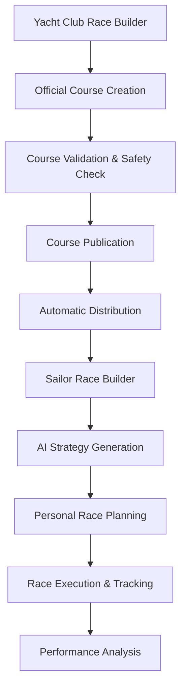

# Dual Race Builder System: User-Type Specific Interfaces
*Living Document - Last Updated: September 26, 2025*

## Overview
RegattaFlow features **two distinct but related race builder interfaces** that serve different user types while sharing core components. This document clarifies the architecture and functionality of both systems.

## User-Type Specific Race Builders

### 🏛️ **Yacht Club Race Builder** (Race Committee Interface)
**Primary Users**: Race officers, sailing managers, yacht club staff
**Purpose**: Create and manage official race courses for regattas and club events

#### Core Functionality
- **Visual Course Design**: OnX Maps-style drag-and-drop course builder
- **Official Course Creation**: Generate courses that become the "source of truth"
- **Race Management**: Start sequences, timing, scoring, protests
- **Publication & Distribution**: Automatically distribute race data to sailor apps
- **Compliance & Safety**: World Sailing rule validation, safety checks
- **Multi-Event Management**: Handle series, championships, multiple divisions

#### Key Features
```typescript
interface YachtClubRaceBuilder {
  courseDesign: {
    visualEditor: 'Drag-and-drop mark placement';
    courseTemplates: 'Professional racing configurations';
    realTimeWeather: 'Live conditions integration';
    safetyValidation: 'Automated compliance checking';
    markDatabase: 'Official mark inventory management';
  };

  raceManagement: {
    startSequences: 'Automated race starts with timing';
    liveTracking: 'Real-time fleet monitoring';
    scoring: 'Integrated race results calculation';
    protests: 'Digital protest and hearing management';
    amendments: 'Course changes and notifications';
  };

  distribution: {
    sailorApps: 'Automatic data push to sailor interfaces';
    documents: 'Generate sailing instructions and NOCs';
    notifications: 'Race updates and amendments';
    integration: 'Connect with club management systems';
  };
}
```

### ⛵ **Sailor Race Builder** (Strategy Interface)
**Primary Users**: Individual sailors, racing teams
**Purpose**: Analyze race courses and develop winning strategies

#### Core Functionality
- **Course Analysis**: Import and analyze race courses from yacht clubs
- **Strategy Development**: AI-powered tactical planning
- **Personal Race Planning**: Crew assignments, equipment selection
- **Performance Tracking**: Compare actual vs planned performance
- **Venue Intelligence**: Location-specific racing knowledge

#### Key Features
```typescript
interface SailorRaceBuilder {
  courseAnalysis: {
    importCourses: 'Receive courses from yacht club race builders';
    aiAnalysis: 'AI-powered course interpretation and strategy';
    weatherIntegration: 'Personal weather routing and tactics';
    venueIntelligence: 'Local knowledge and racing patterns';
    historicalData: 'Past performance at similar courses';
  };

  strategyPlanning: {
    tacticalPlanning: 'Race-specific strategy development';
    crewPlanning: 'Role assignments and communication plans';
    equipmentSelection: 'Boat setup optimization';
    contingencyPlanning: 'Multiple scenario preparations';
    raceSimulation: 'Monte Carlo tactical simulations';
  };

  execution: {
    raceDay: 'Live tactical guidance during racing';
    performance: 'Real-time tracking vs strategy';
    postRaceAnalysis: 'Strategy effectiveness review';
    learning: 'AI-powered improvement recommendations';
  };
}
```

## Shared Component Architecture

### Core Shared Components
Both race builders share fundamental components but configure them differently:

```typescript
// Shared Components
export const SharedRaceComponents = {
  CourseVisualization: 'MapLibre GL-based 3D course display',
  WeatherIntegration: 'Real-time weather data and forecasting',
  MarkLibrary: 'Standard racing marks and configurations',
  VenueIntelligence: 'Location-specific knowledge system',
  CourseTemplates: 'Standard racing course configurations',
  ValidationEngine: 'Safety and rule compliance checking'
};

// User-Type Specific Configurations
export const YachtClubConfiguration = {
  permissions: ['create', 'edit', 'publish', 'manage'],
  features: ['officialCourses', 'raceManagement', 'scoring'],
  interface: 'professional race committee tools',
  dataFlow: 'source → distribution to sailors'
};

export const SailorConfiguration = {
  permissions: ['view', 'analyze', 'strategize', 'track'],
  features: ['strategyPlanning', 'performance', 'aiGuidance'],
  interface: 'personal racing optimization tools',
  dataFlow: 'receive from clubs → personal strategy'
};
```

## Data Flow Architecture

### Yacht Club → Sailor Data Flow


### Key Data Synchronization Points
1. **Course Distribution**: Yacht clubs publish → Sailors receive automatically
2. **Weather Updates**: Real-time sync for both user types
3. **Amendment Notifications**: Course changes propagate immediately
4. **Performance Feedback**: Sailor data can inform club course design

## Implementation Strategy

### Phase 1: Core Shared Components ✅ *Completed*
- [x] Base course visualization system
- [x] Weather integration framework
- [x] Template library foundation
- [x] User-type routing system

### Phase 2: Yacht Club Race Builder (Priority)
- [ ] Professional course design interface
- [ ] Official course creation and validation
- [ ] Race management workflow integration
- [ ] Sailor distribution system

### Phase 3: Sailor Race Builder Enhancement
- [ ] Course import and analysis system
- [ ] AI strategy generation integration
- [ ] Personal performance tracking
- [ ] Advanced tactical planning tools

### Phase 4: Integration & Synchronization
- [ ] Real-time data synchronization
- [ ] Cross-platform notifications
- [ ] Performance feedback loops
- [ ] Advanced analytics integration

## Component Reusability Strategy

### High Reusability (90%+ shared)
- `CourseVisualization` - Same 3D maps, different interaction modes
- `WeatherIntegration` - Same data sources, different tactical focus
- `VenueIntelligence` - Same venue data, different applications

### Medium Reusability (60-90% shared)
- `CourseTemplates` - Shared templates, different customization levels
- `ValidationEngine` - Shared rules, different enforcement levels
- `MarkLibrary` - Same marks, different placement permissions

### Low Reusability (30-60% shared)
- `UserInterface` - Shared design system, different workflows
- `DataManagement` - Shared schemas, different CRUD permissions
- `NotificationSystem` - Shared infrastructure, different message types

## Technical Implementation Notes

### Component Structure
```typescript
src/components/race/
├── shared/              # Shared components (90% reusable)
│   ├── CourseVisualization/
│   ├── WeatherIntegration/
│   ├── VenueIntelligence/
│   └── MarkLibrary/
├── yacht-club/          # Yacht club specific components
│   ├── CourseCreator/
│   ├── RaceManager/
│   └── SailorDistribution/
├── sailor/              # Sailor specific components
│   ├── CourseAnalyzer/
│   ├── StrategyPlanner/
│   └── PerformanceTracker/
└── UserTypeAwareRaces.tsx # Route based on user type
```

### Configuration-Driven Architecture
```typescript
interface RaceBuilderConfig {
  userType: 'yacht_club' | 'sailor' | 'coach';
  permissions: Permission[];
  features: Feature[];
  dataFlow: 'source' | 'consumer';
  interface: InterfaceConfiguration;
}

export function RaceBuilder({ config }: { config: RaceBuilderConfig }) {
  // Render appropriate interface based on configuration
  return config.userType === 'yacht_club'
    ? <YachtClubRaceBuilder {...config} />
    : <SailorRaceBuilder {...config} />;
}
```

## Success Metrics

### Yacht Club Race Builder
- Time to create and publish course: < 15 minutes
- Course validation accuracy: > 95%
- Sailor distribution success rate: > 99%
- Race management efficiency: 50% reduction in manual work

### Sailor Race Builder
- Strategy planning time: < 30 minutes per race
- AI strategy accuracy: > 80% correlation with optimal performance
- Performance improvement tracking: measurable gains over time
- Course analysis depth: comprehensive tactical insights

## Related Documents
- [Yacht Club Management Plan](./club-management.md) - Overall yacht club features
- [Sailor Experience Plan](./sailor-experience.md) - Sailor-focused features
- [Race Strategy Planning](./race-strategy-planning.md) - AI strategy development
- [Technical Architecture](./technical-architecture.md) - System design overview

---

*This dual race builder system ensures that both yacht clubs (race creators) and sailors (race participants) have optimized interfaces for their specific needs while maintaining data consistency and sharing core functionality.*