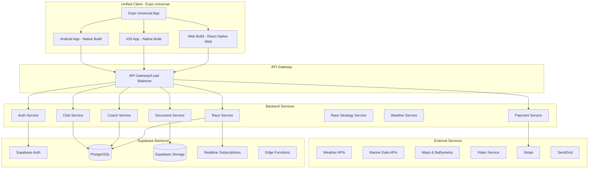

# Technical Architecture Plan - Expo Universal App
*Living Document - Last Updated: September 25, 2025*

## Overview
Technical architecture for RegattaFlow ecosystem using **Expo Universal App** supporting iOS, Android, and Web from a single codebase, with real-time features, offline capability, and scalable infrastructure.

## System Architecture

### High-Level Architecture


## Technology Stack

### Frontend Technologies - Expo Universal
```typescript
interface UniversalFrontendStack {
  platform: {
    framework: 'Expo SDK 54+';
    router: 'Expo Router';
    webRenderer: 'React Native Web';
    mobileRenderer: 'React Native';
  };
  styling: {
    mobile: 'NativeWind (Tailwind CSS for React Native)';
    web: 'Automatic Tailwind CSS via React Native Web';
    responsive: 'useWindowDimensions hook for breakpoints';
  };
  components: {
    universal: 'React Native components work everywhere';
    platformSpecific: 'Platform.OS conditional rendering';
    forms: 'React Hook Form + React Native inputs';
    validation: 'Zod schemas for universal validation';
  };
  state: {
    client: 'Zustand for cross-platform state';
    offline: 'AsyncStorage for persistence';
    cache: 'React Query for server state';
  };
  shared: {
    language: 'TypeScript';
    navigation: 'Expo Router (file-based routing)';
    auth: 'Supabase Auth';
    testing: 'Jest + React Native Testing Library';
  };
}
```

### Platform-Specific Optimizations
```typescript
interface PlatformOptimizations {
  web: {
    seo: 'React Native Web with proper meta tags';
    responsive: 'Breakpoint-based layouts';
    performance: 'Code splitting with Expo Router';
    accessibility: 'Web accessibility standards';
  };
  mobile: {
    performance: 'Native React Native optimizations';
    offline: 'AsyncStorage and file system caching';
    hardware: 'Camera, GPS, sensors integration';
    notifications: 'Push notifications via Expo';
  };
  universal: {
    components: 'Single component codebase';
    navigation: 'Unified routing system';
    state: 'Consistent state management';
    apis: 'Platform-agnostic service layer';
  };
}
```

### Backend Technologies (Unchanged)
```typescript
interface BackendStack {
  runtime: 'Node.js 20 LTS';
  framework: 'Cloud Functions';
  database: {
    primary: 'PostgreSQL (Supabase)';
    cache: 'Redis';
    search: 'Algolia';
    timeseries: 'InfluxDB';
    geospatial: 'PostGIS for venue locations';
  };
  storage: {
    documents: 'Supabase Storage';
    images: 'Cloudinary';
    videos: 'Cloudflare Stream';
    venueData: 'Distributed regional storage';
  };
  services: {
    auth: 'Supabase Auth';
    payments: 'Stripe';
    email: 'SendGrid';
    sms: 'Twilio';
    push: 'Expo Notifications';
    maps: 'MapLibre GL JS (universal)';
    weather: 'Multi-regional weather APIs';
    location: 'Expo Location (universal)';
  };
  ai: {
    primary: 'Google AI (Gemini)';
    documentParsing: 'Sailing instruction extraction';
    strategy: 'Race strategy generation';
    translation: 'Multi-language venue support';
  };
}
```

## Universal App Development Patterns

### Platform Detection and Adaptation
```typescript
// Universal component with platform-specific optimizations
import { Platform, useWindowDimensions } from 'react-native';

export function UniversalRaceDisplay({ race }: { race: Race }) {
  const { width } = useWindowDimensions();
  const isWeb = Platform.OS === 'web';
  const isDesktop = width > 768;

  // Responsive layout
  const layout = isDesktop ? 'row' : 'column';

  // Platform-specific optimizations
  if (isWeb) {
    return (
      <WebOptimizedRaceView
        race={race}
        layout={layout}
        seoOptimized={true}
      />
    );
  }

  // Mobile-optimized (iOS/Android)
  return (
    <MobileOptimizedRaceView
      race={race}
      layout={layout}
      offlineCapable={true}
    />
  );
}
```

### Universal Navigation
```typescript
// Expo Router file-based routing works across platforms
// app/(tabs)/races.tsx - Works on mobile and web

import { Stack, useRouter } from 'expo-router';

export default function RacesScreen() {
  const router = useRouter();

  return (
    <>
      <Stack.Screen
        options={{
          title: "Races",
          // Web gets additional SEO meta
          ...(Platform.OS === 'web' && {
            description: "Track sailing races and performance"
          })
        }}
      />
      <RacesList
        onRacePress={(raceId) => {
          // Universal navigation
          router.push(`/races/${raceId}`);
        }}
      />
    </>
  );
}
```

### Universal State Management
```typescript
// Zustand store works across all platforms
import { create } from 'zustand';
import { persist, createJSONStorage } from 'zustand/middleware';
import AsyncStorage from '@react-native-async-storage/async-storage';

interface AppState {
  currentVenue: SailingVenue | null;
  userPreferences: UserPreferences;
  setCurrentVenue: (venue: SailingVenue) => void;
}

export const useAppStore = create<AppState>()(
  persist(
    (set) => ({
      currentVenue: null,
      userPreferences: {},
      setCurrentVenue: (venue) => set({ currentVenue: venue }),
    }),
    {
      name: 'regattaflow-store',
      storage: createJSONStorage(() => AsyncStorage), // Works on all platforms
    }
  )
);
```

## Data Models (Unchanged)

### Core Entities
```typescript
// Same data models as before - unchanged
interface User {
  id: string;
  profile: {
    name: string;
    email: string;
    phone?: string;
    location: Location;
    avatar?: URL;
  };
  sailing: {
    classes: string[];
    club?: ClubMembership;
    boat?: BoatDetails;
    experience: ExperienceLevel;
  };
  subscription: {
    tier: 'free' | 'sailor_pro' | 'championship';
    status: 'active' | 'cancelled' | 'past_due';
    validUntil: Date;
  };
  roles: ('sailor' | 'coach' | 'race_officer' | 'admin')[];
  created: Timestamp;
  lastActive: Timestamp;
}

// All other models remain the same...
```

## API Design (Largely Unchanged)

### Universal API Client
```typescript
// Universal API client works across platforms
import { Platform } from 'react-native';

class UniversalAPIClient {
  private baseURL = Platform.select({
    web: process.env.EXPO_PUBLIC_API_URL,
    default: process.env.EXPO_PUBLIC_API_URL,
  });

  async makeRequest<T>(endpoint: string, options?: RequestInit): Promise<T> {
    const response = await fetch(`${this.baseURL}${endpoint}`, {
      headers: {
        'Content-Type': 'application/json',
        // Platform-specific headers
        'User-Agent': Platform.OS === 'web'
          ? 'RegattaFlow-Web'
          : `RegattaFlow-${Platform.OS}`,
        ...options?.headers,
      },
      ...options,
    });

    return response.json();
  }
}
```

### RESTful Endpoints (Unchanged)
```typescript
interface APIEndpoints {
  auth: {
    POST: '/auth/login';
    POST: '/auth/register';
    POST: '/auth/refresh';
    POST: '/auth/logout';
  };
  races: {
    GET: '/races';
    GET: '/races/:id';
    POST: '/races/:id/track';
    GET: '/races/:id/results';
  };
  documents: {
    POST: '/documents/upload';
    POST: '/documents/parse';
    GET: '/documents/:id';
    GET: '/events/:eventId/documents';
  };
  venues: {
    GET: '/venues';
    GET: '/venues/:id';
    GET: '/venues/nearby';
    GET: '/venues/:id/intelligence';
    GET: '/venues/:id/weather';
    GET: '/venues/:id/cultural';
    POST: '/venues/:id/visit';
  };
  // ... same as before
}
```

## Development Workflow - Expo Universal

### Build and Deployment
```typescript
interface ExpoDeployment {
  development: {
    command: 'expo start';
    platforms: ['web', 'ios', 'android'];
    hotReload: 'All platforms simultaneously';
  };

  building: {
    web: {
      command: 'expo export:web';
      output: 'Static files for Vercel';
      optimization: 'Automatic bundle splitting';
    };
    mobile: {
      ios: 'eas build --platform ios';
      android: 'eas build --platform android';
      updates: 'eas update for OTA updates';
    };
  };

  deployment: {
    web: {
      hosting: 'Vercel';
      process: 'expo export:web → vercel deploy';
      url: 'app.regattaflow.com';
    };
    mobile: {
      distribution: 'App Store / Google Play';
      updates: 'OTA updates via EAS Update';
      testing: 'TestFlight / Internal Testing';
    };
  };
}
```

### CI/CD Pipeline - Updated for Expo
```yaml
pipeline:
  stages:
    - lint:
        tools: ['ESLint', 'Prettier']
        command: 'expo lint'
    - test:
        unit: 'Jest with React Native Testing Library'
        integration: 'Expo testing tools'
        e2e: 'Detox for mobile, Playwright for web'
    - build:
        web: 'expo export:web'
        mobile: 'eas build --platform all'
    - deploy:
        web: 'Vercel deployment'
        mobile: 'EAS Submit to stores'
        staging: 'Automatic on PR merge'
        production: 'Manual approval required'
```

### Environment Management
```typescript
interface ExpoEnvironments {
  local: {
    command: 'expo start';
    database: 'Supabase local development';
    auth: 'Supabase Auth local';
    storage: 'Local filesystem';
    platforms: ['web', 'ios', 'android'];
  };
  staging: {
    web: 'staging.regattaflow.com';
    mobile: 'EAS Build Preview';
    data: 'Copy of production';
    features: 'All flags enabled';
  };
  production: {
    web: 'app.regattaflow.com (Vercel)';
    mobile: 'App Store / Google Play';
    updates: 'EAS Update for instant fixes';
    rollback: 'Instant reversion capability';
  };
}
```

## Universal File Structure

### Expo App Router Structure
```
regattaflow-app/
├── app/                          # Expo Router - Universal navigation
│   ├── (tabs)/                   # Tab navigation (mobile + web)
│   │   ├── _layout.tsx          # Tab layout
│   │   ├── index.tsx            # Home screen
│   │   ├── races.tsx            # Races list
│   │   ├── strategy.tsx         # Race strategy
│   │   ├── map.tsx              # Map view
│   │   └── profile.tsx          # User profile
│   ├── (auth)/                   # Authentication flows
│   │   ├── login.tsx            # Login screen
│   │   └── signup.tsx           # Signup screen
│   ├── (marketing)/              # Marketing pages (web-optimized)
│   │   ├── _layout.tsx          # Marketing layout
│   │   ├── index.tsx            # Homepage
│   │   ├── features.tsx         # Features page
│   │   ├── pricing.tsx          # Pricing page
│   │   └── about.tsx            # About page
│   ├── races/                    # Race details
│   │   └── [id].tsx             # Dynamic race page
│   ├── venues/                   # Venue pages
│   │   └── [id].tsx             # Dynamic venue page
│   ├── _layout.tsx              # Root layout
│   └── +html.tsx                # Custom HTML for web
├── src/                          # Source code
│   ├── components/               # Universal components
│   ├── lib/                      # Utilities and configurations
│   ├── contexts/                 # React contexts
│   ├── hooks/                    # Custom hooks
│   ├── services/                 # API services
│   └── types/                    # TypeScript definitions
├── assets/                       # Static assets
├── plans/                        # Planning documents
└── app.json                      # Expo configuration
```

## Performance Optimization - Universal

### Platform-Specific Optimizations
```typescript
interface UniversalPerformance {
  web: {
    bundleSplitting: 'Automatic with Expo Router';
    caching: 'Service worker for PWA features';
    seo: 'Server-side rendering capabilities';
    images: 'Responsive image loading';
  };
  mobile: {
    bundleSize: 'Optimized React Native bundles';
    memory: 'Efficient state management';
    battery: 'Background task optimization';
    offline: 'Comprehensive caching strategies';
  };
  universal: {
    components: 'Single codebase reduces maintenance';
    state: 'Unified state management';
    apis: 'Consistent service layer';
    testing: 'Shared test utilities';
  };
}
```

### Caching Strategy - Updated
```typescript
interface UniversalCaching {
  web: {
    serviceWorker: 'PWA caching for offline web';
    localStorage: 'User preferences and auth tokens';
    cdnCache: 'Static assets via Vercel edge';
  };
  mobile: {
    asyncStorage: 'User preferences and offline data';
    fileSystem: 'Documents and images cache';
    sqlite: 'Complex offline data (via Expo SQLite)';
  };
  universal: {
    reactQuery: 'API response caching';
    zustand: 'Global state persistence';
    imageCache: 'Optimized image loading';
  };
}
```

## Global Data Infrastructure (Unchanged)

### Location Services Architecture
```typescript
// Same global infrastructure as before
interface GlobalLocationServices {
  venueDetection: {
    gps: {
      accuracy: 'Sub-50m venue detection via Expo Location';
      fallback: 'Network-based location estimation';
      offline: 'Last known venue with cached intelligence';
    };
    // ... rest unchanged
  };
  // ... rest unchanged
}
```

## Migration-Specific Considerations

### From Next.js to Expo Web
```typescript
interface MigrationConsiderations {
  components: {
    from: 'React components with HTML elements';
    to: 'React Native components with universal rendering';
    adaptation: 'Text → Text, View → View, etc.';
  };
  styling: {
    from: 'Tailwind CSS classes';
    to: 'NativeWind (Tailwind for React Native)';
    compatibility: '95% class compatibility';
  };
  routing: {
    from: 'Next.js App Router';
    to: 'Expo Router (similar file-based routing)';
    migration: 'File structure largely compatible';
  };
  deployment: {
    from: 'Vercel Next.js deployment';
    to: 'Vercel + expo export:web deployment';
    process: 'Similar deployment pipeline';
  };
}
```

### Feature Parity Checklist
```typescript
interface FeatureParityChecklist {
  authentication: 'Migrate Supabase auth context';
  payments: 'Integrate Stripe SDK for React Native';
  documents: 'Use expo-document-picker for file upload';
  maps: 'MapLibre GL JS works universally';
  offline: 'Enhanced with mobile-specific capabilities';
  realtime: 'Supabase subscriptions work universally';
  notifications: 'Enhanced with mobile push notifications';
  seo: 'Maintain web SEO with proper meta tags';
}
```

## Monitoring & Observability (Enhanced)

### Universal Monitoring
```typescript
interface UniversalMonitoring {
  errors: {
    web: 'Sentry for web error tracking';
    mobile: 'Sentry + Expo error reporting';
    universal: 'Unified error dashboard';
  };
  performance: {
    web: 'Web Vitals and Lighthouse scores';
    mobile: 'React Native performance monitoring';
    bundle: 'Bundle size analysis across platforms';
  };
  analytics: {
    events: 'Universal event tracking';
    funnels: 'Cross-platform user journeys';
    retention: 'Platform-specific retention analysis';
  };
}
```

## Related Documents
- [Next.js to Expo Migration Plan](./nextjs-to-expo-migration.md) - **ACTIVE MIGRATION**
- [Master Plan](./regattaflow-master-plan.md)
- [Global Sailing Venues](./global-sailing-venues.md) - Venue intelligence system design
- [Sailor Experience](./sailor-experience.md) - Enhanced with global venue features
- [Race Strategy Planning](./race-strategy-planning.md) - Regional intelligence integration
- [Workflow](./WORKFLOW.md) - Updated for Expo Universal development

---
*This document reflects the new Expo Universal architecture. Updated during Next.js to Expo migration.*